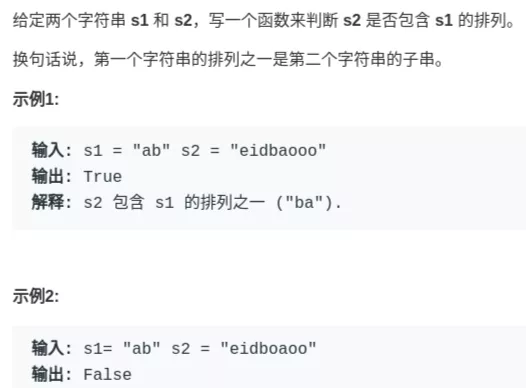

# 双指针算法

## 一、快慢指针的常见算法

快慢指针一般都初始化指向链表的头结点`head`，前进时快指针`fast`在前，慢指针`slow`在后，巧妙解决一些链表中的问题。

**1、判定链表中是否含有环**

经典解法就是用两个指针，一个跑得快，一个跑得慢。如果不含有环，跑得快的那个指针最终会遇到`null`，说明链表不含环；如果含有环，快指针最终会超慢指针一圈，和慢指针相遇，说明链表含有环。

力扣第 141 题就是这个问题，解法代码如下：

```cpp
boolean hasCycle(ListNode head) {
    ListNode fast, slow;
    fast = slow = head;
    while (fast != null && fast.next != null) {
        fast = fast.next.next;
        slow = slow.next;

        if (fast == slow) return true;
    }
    return false;
}
```

**2、已知链表中含有环，返回这个环的起始位置**

.png>)

这个问题一点都不困难，有点类似脑筋急转弯，先直接看代码：

```cpp
ListNode detectCycle(ListNode head) {
    ListNode fast, slow;
    fast = slow = head;
    while (fast != null && fast.next != null) {
        fast = fast.next.next;
        slow = slow.next;
        if (fast == slow) break;
    }
    // 上面的代码类似 hasCycle 函数
    slow = head;
    while (slow != fast) {
        fast = fast.next;
        slow = slow.next;
    }
    return slow;
}
```

可以看到，当快慢指针相遇时，让其中任一个指针指向头节点，然后让它俩以相同速度前进，再次相遇时所在的节点位置就是环开始的位置。这是为什么呢？

第一次相遇时，假设慢指针`slow`走了`k`步，那么快指针`fast`一定走了`2k`步：

.png>)

**`fast`一定比`slow`多走了`k`步，这多走的`k`步其实就是`fast`指针在环里转圈圈，所以`k`的值就是环长度的「整数倍」**。

说句题外话，之前还有读者争论为什么是环长度整数倍，我举个简单的例子你就明白了，我们想一想极端情况，假设环长度就是 1，如下图：

.png>)

那么`fast`肯定早早就进环里转圈圈了，而且肯定会转好多圈，这不就是环长度的整数倍嘛。

言归正传，设相遇点距环的起点的距离为`m`，那么环的起点距头结点`head`的距离为`k - m`，也就是说如果从`head`前进`k - m`步就能到达环起点。

巧的是，如果从相遇点继续前进`k - m`步，也恰好到达环起点。你甭管`fast`在环里到底转了几圈，反正走`k`步可以到相遇点，那走`k - m`步一定就是走到环起点了：

.png>)

所以，只要我们把快慢指针中的任一个重新指向`head`，然后两个指针同速前进，`k - m`步后就会相遇，相遇之处就是环的起点了。

**3、寻找链表的中点**

类似上面的思路，我们还可以让快指针一次前进两步，慢指针一次前进一步，当快指针到达链表尽头时，慢指针就处于链表的中间位置。

力扣第 876 题就是找链表中点的题目，解法代码如下：

```cpp
ListNode middleNode(ListNode head) {
    ListNode fast, slow;
    fast = slow = head;
    while (fast != null && fast.next != null) {
        fast = fast.next.next;
        slow = slow.next;
    }
    // slow 就在中间位置
    return slow;
}
```

当链表的长度是奇数时，`slow`恰巧停在中点位置；如果长度是偶数，`slow`最终的位置是中间偏右：

.png>)

寻找链表中点的一个重要作用是对链表进行归并排序。

回想数组的归并排序：求中点索引递归地把数组二分，最后合并两个有序数组。对于链表，合并两个有序链表是很简单的，难点就在于二分。

但是现在你学会了找到链表的中点，就能实现链表的二分了。关于归并排序的具体内容本文就不具体展开了。

**4、寻找链表的倒数第`n`个元素**

这是力扣第 19 题「删除链表的倒数第`n`个元素」，先看下题目：

.png>)

我们的思路还是使用快慢指针，让快指针先走`n`步，然后快慢指针开始同速前进。这样当快指针走到链表末尾`null`时，慢指针所在的位置就是倒数第`n`个链表节点（`n`不会超过链表长度）。

解法比较简单，直接看代码吧：

```cpp
ListNode removeNthFromEnd(ListNode head, int n) {
    ListNode fast, slow;
    fast = slow = head;
    // 快指针先前进 n 步
    while (n-- > 0) {
        fast = fast.next;
    }
    if (fast == null) {
        // 如果此时快指针走到头了，
        // 说明倒数第 n 个节点就是第一个节点
        return head.next;
    }
    // 让慢指针和快指针同步向前
    while (fast != null && fast.next != null) {
        fast = fast.next;
        slow = slow.next;
    }
    // slow.next 就是倒数第 n 个节点，删除它
    slow.next = slow.next.next;
    return head;
}
```

## 二、左右指针的常用算法

左右指针在数组中实际是指两个索引值，一般初始化为`left = 0, right = nums.length - 1`。

**1、二分查找**

前文 [二分查找框架详解](http://mp.weixin.qq.com/s?\_\_biz=MzAxODQxMDM0Mw==\&mid=2247485044\&idx=1\&sn=e6b95782141c17abe206bfe2323a4226\&chksm=9bd7f87caca0716aa5add0ddddce0bfe06f1f878aafb35113644ebf0cf0bfe51659da1c1b733\&scene=21#wechat\_redirect) 有详细讲解，这里只写最简单的二分算法，旨在突出它的双指针特性：

```cpp
int binarySearch(int[] nums, int target) {
    int left = 0; 
    int right = nums.length - 1;
    while(left <= right) {
        int mid = (right + left) / 2;
        if(nums[mid] == target)
            return mid; 
        else if (nums[mid] < target)
            left = mid + 1; 
        else if (nums[mid] > target)
            right = mid - 1;
    }
    return -1;
}
```

**2、两数之和**

直接看力扣第 167 题「两数之和 II」吧：

.png>)

只要数组有序，就应该想到双指针技巧。这道题的解法有点类似二分查找，通过调节`left`和`right`可以调整`sum`的大小：

```cpp
int[] twoSum(int[] nums, int target) {
    int left = 0, right = nums.length - 1;
    while (left < right) {
        int sum = nums[left] + nums[right];
        if (sum == target) {
            // 题目要求的索引是从 1 开始的
            return new int[]{left + 1, right + 1};
        } else if (sum < target) {
            left++; // 让 sum 大一点
        } else if (sum > target) {
            right--; // 让 sum 小一点
        }
    }
    return new int[]{-1, -1};
}
```

**3、反转数组**

一般编程语言都会提供`reverse`函数，其实非常简单，力扣第 344 题是类似的需求，让你反转一个`char[]`类型的字符数组，我们直接看代码吧：

```cpp
void reverseString(char[] arr) {
    int left = 0;
    int right = arr.length - 1;
    while (left < right) {
        // 交换 arr[left] 和 arr[right]
        char temp = arr[left];
        arr[left] = arr[right];
        arr[right] = temp;
        left++; right--;
    }
}
```

## 三、滑动窗口

**滑动窗口算法的代码框架**：

```cpp
/* 滑动窗口算法框架 */
void slidingWindow(string s, string t) {
    unordered_map<char, int> need, window;
    for (char c : t) need[c]++;

    int left = 0, right = 0;
    int valid = 0; 
    while (right < s.size()) {
        // c 是将移入窗口的字符
        char c = s[right];
        // 右移窗口
        right++;
        // 进行窗口内数据的一系列更新
        ...

        /*** debug 输出的位置 ***/
        printf("window: [%d, %d)\n", left, right);
        /********************/

        // 判断左侧窗口是否要收缩
        while (window needs shrink) {
            // d 是将移出窗口的字符
            char d = s[left];
            // 左移窗口
            left++;
            // 进行窗口内数据的一系列更新
            ...
        }
    }
}
```

**其中两处`...`表示的更新窗口数据的地方，到时候你直接往里面填就行了**。

而且，这两个`...`处的操作分别是右移和左移窗口更新操作，等会你会发现它们操作是完全对称的。

### 一、最小覆盖子串

LeetCode 76 题，Minimum Window Substring，难度 **Hard**，我带大家看看它到底有多 **Hard**：

.png>)

就是说要在`S`(source) 中找到包含`T`(target) 中全部字母的一个子串，且这个子串一定是所有可能子串中最短的。

如果我们使用暴力解法，代码大概是这样的：

```
for (int i = 0; i < s.size(); i++)
    for (int j = i + 1; j < s.size(); j++)
        if s[i:j] 包含 t 的所有字母:
            更新答案
```

思路很直接，但是显然，这个算法的复杂度肯定大于 O(N^2) 了，不好。

**滑动窗口算法的思路是这样**：

_**1、**_我们在字符串`S`中使用双指针中的左右指针技巧，初始化`left = right = 0`，**把索引左闭右开区间`[left, right)`称为一个「窗口」**。

_**2、**_我们先不断地增加`right`指针扩大窗口`[left, right)`，直到窗口中的字符串符合要求（包含了`T`中的所有字符）。

_**3、**_此时，我们停止增加`right`，转而不断增加`left`指针缩小窗口`[left, right)`，直到窗口中的字符串不再符合要求（不包含`T`中的所有字符了）。同时，每次增加`left`，我们都要更新一轮结果。

_**4、**_重复第 2 和第 3 步，直到`right`到达字符串`S`的尽头。

这个思路其实也不难，**第 2 步相当于在寻找一个「可行解」，然后第 3 步在优化这个「可行解」，最终找到最优解，**也就是最短的覆盖子串。左右指针轮流前进，窗口大小增增减减，窗口不断向右滑动，这就是「滑动窗口」这个名字的来历。

下面画图理解一下，`needs`和`window`相当于计数器，分别记录`T`中字符出现次数和「窗口」中的相应字符的出现次数。

初始状态：

.png>)

增加`right`，直到窗口`[left, right)`包含了`T`中所有字符：

.png>)

现在开始增加`left`，缩小窗口`[left, right)`。

.png>)

直到窗口中的字符串不再符合要求，`left`不再继续移动。

.png>)

之后重复上述过程，先移动`right`，再移动`left`…… 直到`right`指针到达字符串`S`的末端，算法结束。

如果你能够理解上述过程，恭喜，你已经完全掌握了滑动窗口算法思想。**现在我们来看看这个滑动窗口代码框架怎么用**：

首先，初始化`window`和`need`两个哈希表，记录窗口中的字符和需要凑齐的字符：

```cpp
unordered_map<char, int> need, window;
for (char c : t) need[c]++;
```

然后，使用`left`和`right`变量初始化窗口的两端，不要忘了，区间`[left, right)`是左闭右开的，所以初始情况下窗口没有包含任何元素：

```cpp
int left = 0, right = 0;
int valid = 0; 
while (right < s.size()) {
    // 开始滑动
}
```

**其中`valid`变量表示窗口中满足`need`条件的字符个数**，如果`valid`和`need.size`的大小相同，则说明窗口已满足条件，已经完全覆盖了串`T`。

**现在开始套模板，只需要思考以下四个问题**：

**1、**当移动`right`扩大窗口，即加入字符时，应该更新哪些数据？

**2、**什么条件下，窗口应该暂停扩大，开始移动`left`缩小窗口？

**3、**当移动`left`缩小窗口，即移出字符时，应该更新哪些数据？

**4、**我们要的结果应该在扩大窗口时还是缩小窗口时进行更新？

如果一个字符进入窗口，应该增加`window`计数器；如果一个字符将移出窗口的时候，应该减少`window`计数器；当`valid`满足`need`时应该收缩窗口；应该在收缩窗口的时候更新最终结果。

下面是完整代码：

```cpp
string minWindow(string s, string t) {
    unordered_map<char, int> need, window;
    for (char c : t) need[c]++;

    int left = 0, right = 0;
    int valid = 0;
    // 记录最小覆盖子串的起始索引及长度
    int start = 0, len = INT_MAX;
    while (right < s.size()) {
        // c 是将移入窗口的字符
        char c = s[right];
        // 右移窗口
        right++;
        // 进行窗口内数据的一系列更新
        if (need.count(c)) {
            window[c]++;
            if (window[c] == need[c])
                valid++;
        }

        // 判断左侧窗口是否要收缩
        while (valid == need.size()) {
            // 在这里更新最小覆盖子串
            if (right - left < len) {
                start = left;
                len = right - left;
            }
            // d 是将移出窗口的字符
            char d = s[left];
            // 左移窗口
            left++;
            // 进行窗口内数据的一系列更新
            if (need.count(d)) {
                    window[d]--;
                if (window[d] == need[d])
                    valid--;
            }                    
        }
    }
    // 返回最小覆盖子串
    return len == INT_MAX ?
        "" : s.substr(start, len);
}
```

需要注意的是，当我们发现某个字符在`window`的数量满足了`need`的需要，就要更新`valid`，表示有一个字符已经满足要求。而且，你能发现，两次对窗口内数据的更新操作是完全对称的。

当`valid == need.size()`时，说明`T`中所有字符已经被覆盖，已经得到一个可行的覆盖子串，现在应该开始收缩窗口了，以便得到「最小覆盖子串」。

移动`left`收缩窗口时，窗口内的字符都是可行解，所以应该在收缩窗口的阶段进行最小覆盖子串的更新，以便从可行解中找到长度最短的最终结果。

至此，应该可以完全理解这套框架了，滑动窗口算法又不难，就是细节问题让人烦得很。**以后遇到滑动窗口算法，你就按照这框架写代码，保准没有 bug，还省事儿**。

下面就直接利用这套框架秒杀几道题吧，你基本上一眼就能看出思路了。

### 二、字符串排列

LeetCode 567 题，Permutation in String，难度 Medium：



注意哦，输入的`s1`是可以包含重复字符的，所以这个题难度不小。

这种题目，是明显的滑动窗口算法，**相当给你一个`S`和一个`T`，请问你`S`中是否存在一个子串，包含`T`中所有字符且不包含其他字符**？

首先，先复制粘贴之前的算法框架代码，然后明确刚才提出的 4 个问题，即可写出这道题的答案：

```cpp
// 判断 s 中是否存在 t 的排列
bool checkInclusion(string t, string s) {
    unordered_map<char, int> need, window;
    for (char c : t) need[c]++;

    int left = 0, right = 0;
    int valid = 0;
    while (right < s.size()) {
        char c = s[right];
        right++;
        // 进行窗口内数据的一系列更新
        if (need.count(c)) {
            window[c]++;
            if (window[c] == need[c])
                valid++;
        }

        // 判断左侧窗口是否要收缩
        while (right - left >= t.size()) {
            // 在这里判断是否找到了合法的子串
            if (valid == need.size())
                return true;
            char d = s[left];
            left++;
            // 进行窗口内数据的一系列更新
            if (need.count(d)) {
                if (window[d] == need[d])
                    valid--;
                window[d]--;
            }
        }
    }
    // 未找到符合条件的子串
    return false;
}
```

对于这道题的解法代码，基本上和最小覆盖子串一模一样，只需要改变两个地方：

**1、**本题移动`left`缩小窗口的时机是窗口大小大于`t.size()`时，因为排列嘛，显然长度应该是一样的。

**2、**当发现`valid == need.size()`时，就说明窗口中就是一个合法的排列，所以立即返回`true`。

至于如何处理窗口的扩大和缩小，和最小覆盖子串完全相同。

### 三、找所有字母异位词

这是 LeetCode 第 438 题，Find All Anagrams in a String，难度 Medium：

.png>)

呵呵，这个所谓的字母异位词，不就是排列吗，搞个高端的说法就能糊弄人了吗？**相当于，输入一个串`S`，一个串`T`，找到`S`中所有`T`的排列，返回它们的起始索引**。

直接默写一下框架，明确刚才讲的 4 个问题，即可秒杀这道题：

```cpp
vector<int> findAnagrams(string s, string t) {
    unordered_map<char, int> need, window;
    for (char c : t) need[c]++;

    int left = 0, right = 0;
    int valid = 0;
    vector<int> res; // 记录结果
    while (right < s.size()) {
        char c = s[right];
        right++;
        // 进行窗口内数据的一系列更新
        if (need.count(c)) {
            window[c]++;
            if (window[c] == need[c]) 
                valid++;
        }
        // 判断左侧窗口是否要收缩
        while (right - left >= t.size()) {
            // 当窗口符合条件时，把起始索引加入 res
            if (valid == need.size())
                res.push_back(left);
            char d = s[left];
            left++;
            // 进行窗口内数据的一系列更新
            if (need.count(d)) {
                if (window[d] == need[d])
                    valid--;
                window[d]--;
            }
        }
    }
    return res;
}
```

跟寻找字符串的排列一样，只是找到一个合法异位词（排列）之后将起始索引加入`res`即可。

### 四、最长无重复子串

这是 LeetCode 第 3 题，Longest Substring Without Repeating Characters，难度 Medium：

.png>)

这个题终于有了点新意，不是一套框架就出答案，不过反而更简单了，稍微改一改框架就行了：

```cpp
int lengthOfLongestSubstring(string s) {
    unordered_map<char, int> window;

    int left = 0, right = 0;
    int res = 0; // 记录结果
    while (right < s.size()) {
        char c = s[right];
        right++;
        // 进行窗口内数据的一系列更新
        window[c]++;
        // 判断左侧窗口是否要收缩
        while (window[c] > 1) {
            char d = s[left];
            left++;
            // 进行窗口内数据的一系列更新
            window[d]--;
        }
        // 在这里更新答案
        res = max(res, right - left);
    }
    return res;
}
```

这就是变简单了，连`need`和`valid`都不需要，而且更新窗口内数据也只需要简单的更新计数器`window`即可。

当`window[c]`值大于 1 时，说明窗口中存在重复字符，不符合条件，就该移动`left`缩小窗口了嘛。

唯一需要注意的是，在哪里更新结果`res`呢？我们要的是最长无重复子串，哪一个阶段可以保证窗口中的字符串是没有重复的呢？

这里和之前不一样，**要在收缩窗口完成后更新`res`**，因为窗口收缩的 while 条件是存在重复元素，换句话说收缩完成后一定保证窗口中没有重复嘛。
