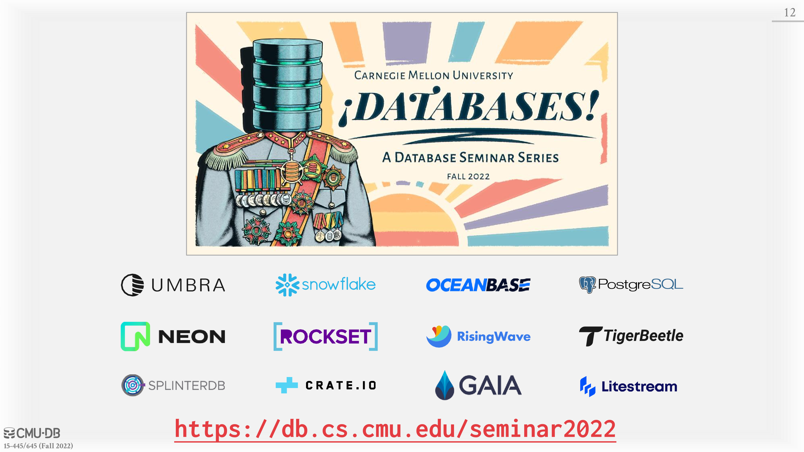
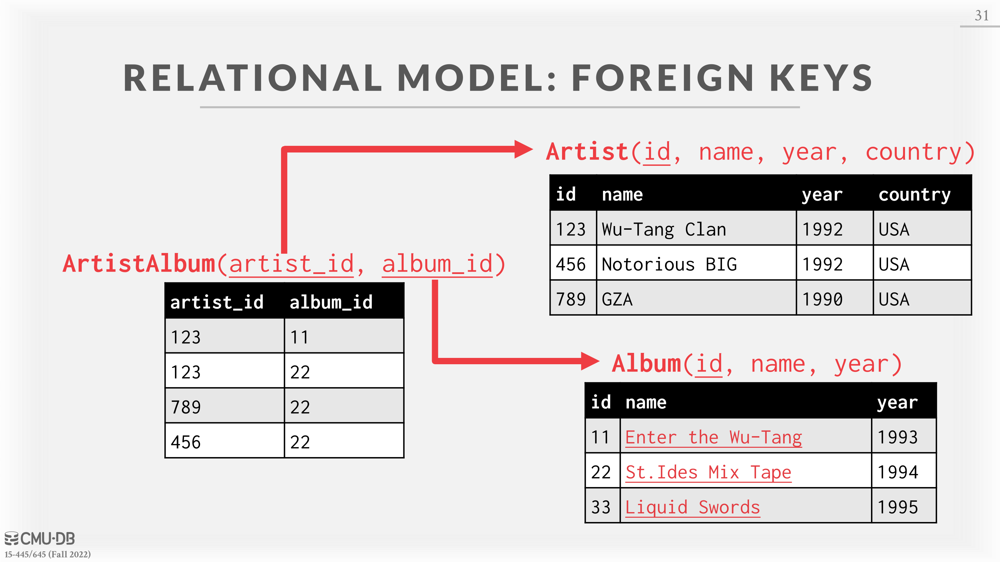

# 01 - Relational Model & Relational Algebra

## DataBase

A database is an organized collection of inter-related data that models some aspect of the real-world (e.g., modeling the students in a class or a digital music store). People often confuse “databases” with “database management systems” (e.g., MySQL, Oracle, MongoDB, Snowflake). A database management system (DBMS) is the software that manages a database.

Consider a database that models a digital music store (e.g., Spotify). Let the database hold information about the artists and which albums those artists have released.

## Flat File Strawman

Database is stored as comma-separated value (CSV) files that the DBMS manages. Each entity will be stored in its own file. The application has to parse files each time it wants to read or update records.

Keeping along with the digital music store example, there would be two files: one for artist and the other for album. Each entity has its own set of attributes, so in each file, different records are delimited by new lines, while each of the corresponding attributes within a record are delimited by a comma. E.g.: An artist could have a name, year, and country attributes, while an album has name, artist and year attributes. Below is an example CSV file for information about artists with the schema (name, year, country):

### Issues with Flat File

#### Data Integrity

* How do we ensure that the artist is the same for each album entry?
* What if somebody overwrites the album year with an invalid string?
* How do we treat multiple artists on one album?
* What happens when we delete an artist with an album?

#### Implementation

* How do we find a particular record?
* What if we now want to create a new application that uses the same database?
* What if two threads try to write to the same file at the same time?

#### Durability

* What if the machine crashes while our program is updating a record?
* What if we want to replicate the database on multiple machines for high availability?

## Database Management System

A DBMS is a software that allows applications to store and analyze information in a database. A general-purpose DBMS is designed to allow the definition, creation, querying, update, and administration of databases in accordance with some data model.

A data model is a collection of concepts for describing the data in database.

* Examples: relational (most common), NoSQL (key/value, graph), array/matrix/vectors

**A schema is a description of a particular collection of data based on a data model.**

### Early DBMSs

Database applications were difficult to build and maintain because there was a tight coupling between logical and physical layers.

The logical layer describes which entities and attributes the database has while the physical layer is how those entities and attributes are being stored. Early on, the physical layer was defined in the application code, so if we wanted to change the physical layer the application was using, we would have to change all of the code to match the new physical layer.

## Relational Model

Ted Codd noticed that people were rewriting DBMSs every time they wanted to change the physical layer, so in 1970 he proposed the relational model to avoid this.

The relational model defines a database abstraction based on relations to avoid maintenance overhead. It has three key points:

* Store database in simple data structures (relations).
* Access data through high-level language, **DBMS figures out best execution strategy**.
* Physical storage left up to the DBMS implementation.

The relational data model defines three concepts:

* **Structure**: The definition of relations and their contents. This is the attributes the relations have and the values that those attributes can hold.
* **Integrity**: Ensure the database’s contents satisfy constraints. An example constraint would be that any value for the year attribute has to be a number.
* **Manipulation**: How to access and modify a database’s contents.

**A \_relation**\*\*\* is an unordered set\*\* that contains the relationship of attributes that represent entities. Since the relationships are unordered, the DBMS can store them in any way it wants, allowing for optimization. \*\*A \*\*\*\*\*tuple\*\*\*\*​ **\_** is a set of attribute values \*\*(also known as its _domain_) in the relation. Originally, values had to be atomic or scalar, but **now values can also be lists or nested data structures**. Every attribute can be a special value, NULL, which means for a given tuple the attribute is undefined. A relation with n attributes is called an _**n-ary relation.**_

### Keys

A relation’s primary key uniquely identifies a single tuple. Some DBMSs automatically create an internal primary key if you do not define one. A lot of DBMSs have support for autogenerated keys so an application does not have to manually increment the keys, but a primary key is still required for some DBMSs.

A _foreign key_ specifies that an attribute from one relation has to map to a tuple in another relation.

## Data Manipulation Languages (DMLs)

Methods to store and retrieve information from a database. There are two classes of languages for this:

* **Procedural**: The query specifies the (high-level) strategy the DBMS should use to find the desired result based on sets / bags. (relational algebra)
* **Non-Procedural (Declarative)** : The query specifies only what data is wanted and not how to find it.(relational calculus)

## Relational Algebra

_Relational Algebra_ is a set of fundamental operations to retrieve and manipulate tuples in a relation. Each operator takes in one or more relations as inputs, and outputs a new relation. To write queries we can “chain” these operators together to create more complex operations.

### Select

Select takes in a relation and outputs a subset of the tuples from that relation that satisfy a selection predicate. The predicate acts like a filter, and we can combine multiple predicates using conjunctions and disjunctions. Syntax: $σ\_{predicate} (R)$. Example: $σ\_{a\_id}=’a2’ (R)$ SQL: `SELECT * FROM R WHERE a_id = 'a2'`

### Projection

Projection takes in a relation and outputs a relation with tuples that contain only specified attributes. You can rearrange the ordering of the attributes in the input relation as well as manipulate the values. Syntax: $π\_{A1,A2,. . . ,An} (R)$. Example: $π\_{b\_id-100, a\_id}(σ\_{a\_id}=’a2’ (R))$ SQL: `SELECT b_id-100, a_id FROM R WHERE a_id = 'a2'`

### Union

Union takes in two relations and outputs a relation that **contains all tuples** that appear in at least one of the input relations. Note: The two input relations have to have the exact same attributes. Syntax: $(R ∪ S)$. SQL: `(SELECT * FROM R) UNION ALL (SELECT * FROM S)`

## Intersection

Intersection takes in two relations and outputs a relation that contains all tuples that appear in **both** of the input relations. Note: The two input relations have to have the exact same attributes. Syntax: $(R ∩ S)$. SQL: `(SELECT * FROM R) INTERSECT (SELECT * FROM S)`

### Difference

Difference takes in two relations and outputs a relation that contains all tuples that appear in the \*\*first relation but not the second \*\*relation. Note: The two input relations have to have the exact same attributes. Syntax: $(R − S)$. SQL: `(SELECT * FROM R) EXCEPT (SELECT * FROM S)`

### Product

Product takes in two relations and outputs a relation that contains **all possible combinations** for tuples from the input relations. Syntax: $(R × S)$. SQL: `(SELECT * FROM R) CROSS JOIN (SELECT * FROM S)`, or simply `SELECT * FROM R, S`

### Join

Join takes in two relations and outputs a relation that contains all the tuples that are a **combination of two tuples** where for **each attribute that the two relations share,** the values for that attribute of both tuples is the same. Syntax: $(R ▷◁ S)$. SQL: `SELECT * FROM R JOIN S USING (ATTRIBUTE1, ATTRIBUTE2...)`

## Observation

**Relational algebra is a procedural language** because it defines the high level-steps of how to compute a query. For example, $σ\_{b\_id=102} (R ▷◁ S)$ is saying to first do the join of R and S and then do the select, whereas ($R ▷◁ (σ\_{b\_id=102} (S))$) will do the select on S first, and then do the join. **These two statements will actually produce the same answer**, but if there is only 1 tuple in S with $b\_id=102$ out of a billion tuples, then ($R ▷◁ (σ\_{b\_id=102} (S))$) will be significantly faster than $σ\_{b\_id=102} (R ▷◁ S)$.

A better approach is to say the result you want (retrieve the joined tuples from R and S where $b\_id$ equals 102), and **let the DBMS decide the steps it wants to take to compute the query.** SQL will do exactly this, and it is the de facto standard for writing queries on relational model databases.

