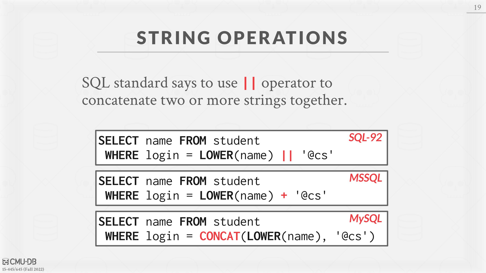
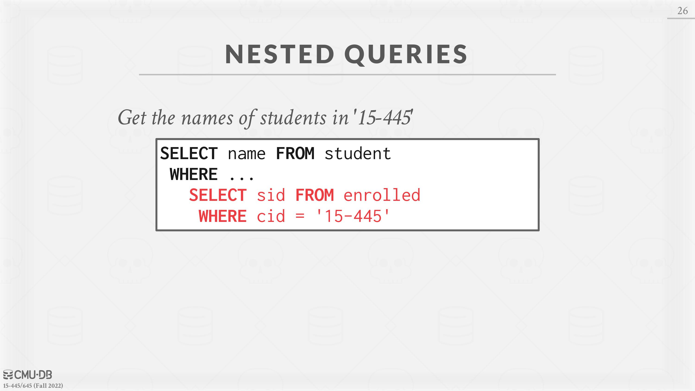

# 02 - Modern SQL


# Relational Languages

Edgar Codd published a major paper on relational models in the early 1970s. Originally, he only defined the mathematical notation for how a DBMS could execute queries on a relational model DBMS.
The user only needs to specify the result that they want using a declarative language (i.e., SQL). The DBMS is responsible for determining the most efficient plan to produce that answer.
Relational algebra is based on **sets** (unordered, no duplicates). SQL is based on **bags** (unordered, allows duplicates).

# SQL History

Declarative query language for relational databases. It was originally developed in the 1970s as part of the IBM **System R** project. IBM originally called it “SEQUEL” (Structured English Query Language). The name changed in the 1980s to just “SQL” (Structured Query Language).

The language is comprised of different classes of commands:

1. **Data Manipulation Language (DML):**  SELECT, INSERT, UPDATE, and DELETE statements.
2. **Data Definition Language (DDL): **Schema definitions for tables, indexes, views, and other objects.
3. **Data Control Language (DCL): **Security, access controls.


SQL is not a dead language. It is being updated with new features every couple of years. SQL-92 is the minimum that a DBMS has to support to claim they support SQL. Each vendor follows the standard to a certain degree but there are many proprietary extensions.


Some of the major updates released with each new edition of the SQL standard are shown below.

- SQL:1999 Regular expressions, Triggers
- SQL:2003 XML, Windows, Sequences
- SQL:2008 Truncation, Fancy sorting
- SQL:2011 Temporal DBs, Pipelined DML
- SQL:2016 JSON, Polymorphic tables


# Joins

Combines columns from one or more tables and produces a new table. Used to express queries that involve data that spans multiple tables.
Example: *Which students got an A in 15-721?*

```SQL
CREATE TABLE student (
  sid INT PRIMARY KEY,
  name VARCHAR(16),
  login VARCHAR(32) UNIQUE,
  age SMALLINT,
  gpa FLOAT
);

CREATE TABLE course (
  cid VARCHAR(32) PRIMARY KEY,
  name VARCHAR(32) NOT NULL
);

CREATE TABLE enrolled (
  sid INT REFERENCES student (sid),
  cid VARCHAR(32) REFERENCES course (cid),
  grade CHAR(1)
);
```


```SQL
SELECT s.name
	FROM enrolled AS e, student AS s
WHERE e.grade = 'A' AND e.cid = '15-721'
	AND e.sid = s.sid;
```

# Aggregates

An aggregation function takes in a bag of tuples as its input and then produces a single scalar value as its output. **Aggregate functions can (almost) only be used in a SELECT output list.**

- AVG(COL): The average of the values in COL
- MIN(COL): The minimum value in COL
- MAX(COL): The maximum value in COL
- COUNT(COL): The number of tuples in the relation


Example: *Get # of students with a ‘@cs’ login*.
The following three queries are equivalent:

```SQL
SELECT COUNT(*) FROM student WHERE login LIKE '%@cs';

SELECT COUNT(login) FROM student WHERE login LIKE '%@cs';

SELECT COUNT(1) FROM student WHERE login LIKE '%@cs';
```


**A single SELECT statement can contain multiple aggregates**:
Example: *Get # of students and their average GPA with a ‘@cs’ login*.

```SQL
SELECT AVG(gpa), COUNT(sid) FROM student WHERE login LIKE '%@cs';
```


Some aggregate functions (e.g. COUNT, SUM, AVG) support the DISTINCT keyword:
Example: *Get # of unique students and their average GPA with a ‘@cs’ login.*

```SQL
SELECT COUNT(DISTINCT login) FROM student WHERE login LIKE '%@cs';
```


Output of other columns outside of an aggregate is **undefined** (e.cid is undefined below).
Example: *Get the average GPA of students in each course.*

```SQL
SELECT AVG(s.gpa), e.cid FROM enrolled AS e, student AS s WHERE e.sid = s.sid;
```


Non-aggregated values in SELECT output clause must appear in GROUP BY clause.

```SQL
SELECT AVG(s.gpa), e.cid 
	FROM enrolled AS e, student AS s
WHERE e.sid = s.sid
	GROUP BY e.cid;
```


The HAVING clause filters output results based on aggregation computation. This make HAVING behave like a WHERE clause for a GROUP BY.
Example: *Get the set of courses in which the average student GPA is greater than 3.9.*

```SQL
SELECT AVG(s.gpa) AS avg_gpa, e.cid
	FROM enrolled AS e, student AS s
WHERE e.sid = s.sid
	GROUP BY e.cid
HAVING avg_gpa > 3.9;
```

**The above query syntax is supported by many major database systems, but is not compliant with the SQL standard**. To make the query standard compliant, we must repeat use of AVG(S.GPA) in the body of the HAVING clause.

```SQL
SELECT AVG(s.gpa), e.cid
	FROM enrolled AS e, student AS s
WHERE e.sid = s.sid
	GROUP BY e.cid
HAVING AVG(s.gpa) > 3.9;
```


# String Operations

The SQL standard says that strings are **case sensitive **and **single-quotes only**. There are functions to manipulate strings that can be used in any part of a query.


**Pattern Matching: **The LIKE keyword is used for string matching in predicates.

- “%” matches any substrings (including empty).
- “_” matches any one character.


**String Functions SQL-92** defines string functions. Many database systems implement other functions in addition to those in the standard. Examples of standard string functions include `SUBSTRING(S, B, E)` and `UPPER(S)`.


**Concatenation:**  Two vertical bars (“||”) will concatenate two or more strings together into a single string.



# Date and Time

Operations to manipulate DATE and TIME attributes. Can be used in either output or predicates. The specific syntax for date and time operations varies wildly across systems.


# Output Redirection

Instead of having the result a query returned to the client (e.g., terminal), you can tell the DBMS to store the results into another table. You can then access this data in subsequent queries.

- **New Table:**  Store the output of the query into a new (permanent) table.

```SQL
SELECT DISTINCT cid INTO CourseIds FROM enrolled;
```

- **Existing Table**: Store the output of the query into a table that already exists in the database. The target table must have the same number of columns with the same types as the target table, but the **names of the columns in the output query do not have to match**.

```SQL
INSERT INTO CourseIds (SELECT DISTINCT cid FROM enrolled);
```


# Output Control

Since results SQL are unordered, we must use the ORDER BY clause to impose a sort on tuples:

```SQL
SELECT sid, grade FROM enrolled WHERE cid = '15-721'
	ORDER BY grade;
```

The default sort order is ascending (ASC). We can manually specify DESC to reverse the order:

```SQL
SELECT sid, grade FROM enrolled WHERE cid = '15-721'
	ORDER BY grade DESC;
```


We can use multiple ORDER BY clauses to break ties or do more complex sorting:

```SQL
SELECT sid, grade FROM enrolled WHERE cid = '15-721'
ORDER BY grade DESC, sid ASC;
```


We can also use any arbitrary expression in the ORDER BY clause:

```SQL
SELECT sid FROM enrolled WHERE cid = '15-721'
	ORDER BY UPPER(grade) DESC, sid + 1 ASC;
```


By default, the DBMS will return all of the tuples produced by the query. We can use the LIMIT clause to restrict the number of result tuples:

```SQL
SELECT sid, name FROM student WHERE login LIKE '%@cs'
	LIMIT 10;
```

We can also provide an **offset **to return a range in the results:

```SQL
SELECT sid, name FROM student WHERE login LIKE '%@cs'
	LIMIT 20 OFFSET 10;
```

Unless we use an ORDER BY clause with a LIMIT, **the DBMS may produce different tuples in the result **on each invocation of the query because the relational model does not impose an ordering.


# Nested Queries

Invoke queries inside of other queries to execute more complex logic within a single query. Nested queries are often difficult to optimize.
The scope of outer query is included in an inner query (i.e. the **inner query can access attributes from outer query**), but not the other way around.
Inner queries can appear in almost any part of a query:

1. SELECT Output Targets:

```SQL
SELECT (SELECT 1) AS one FROM student;
```

1. FROM Clause:

```SQL
SELECT name
  FROM student AS s, (SELECT sid FROM enrolled) AS e
  WHERE s.sid = e.sid;
```

1. WHERE Clause:

```SQL
SELECT name FROM student
	WHERE sid IN ( SELECT sid FROM enrolled );
```


Example: *Get the names of students that are enrolled in ‘15-445’.*

```SQL
SELECT name FROM student
WHERE sid IN (
SELECT sid FROM enrolled
WHERE cid = '15-445'
);
```

Note that *sid* has different scope depending on where it appears in the query.





Example: *Find student record with the highest id that is enrolled in at least one course.*

```SQL
SELECT student.sid, name
  FROM student
  JOIN (SELECT MAX(sid) AS sid
  	FROM enrolled) AS max_e
  ON student.sid = max_e.sid;
```

## Nested Query Results Expressions:

- ALL: Must satisfy expression for all rows in sub-query.
- ANY: Must satisfy expression for at least one row in sub-query.
- IN: Equivalent to =`ANY()`.
- EXISTS: At least one row is returned.

Example: *Find all courses that have no students enrolled in it.*

```SQL
SELECT * FROM course
  WHERE NOT EXISTS(
  	SELECT * FROM enrolled
  		WHERE course.cid = enrolled.cid
);
```


# Window Functions

A window function perform “sliding” calculation across a set of tuples that are related. Like an aggregation but tuples are not grouped into a single output tuple.
**Functions: **The window function can be any of the aggregation functions that we discussed above. There are also also special window functions:

1. `ROW_NUMBER`: The number of the current row.
2. `RANK`: The order position of the current row.


**Grouping:**  The OVER clause specifies how to group together tuples when computing the window function. Use **PARTITION BY** to specify group.

```SQL
SELECT cid, sid, ROW_NUMBER() OVER (PARTITION BY cid)
FROM enrolled ORDER BY cid;
```


We can also put an **ORDER BY** within OVER to ensure a deterministic ordering of results even if database changes internally.

```SQL
SELECT *, ROW_NUMBER() OVER (ORDER BY cid)
FROM enrolled ORDER BY cid;
```


**IMPORTANT:**  The DBMS computes RANK after the window function sorting, whereas it computes ROW_NUMBER before the sorting.
Example: Find the student with the second highest grade for each course.

```SQL
SELECT * FROM (
	SELECT *, RANK() OVER (PARTITION BY cid
		ORDER BY grade ASC) AS rank
	FROM enrolled) AS ranking
WHERE ranking.rank = 2;
```


# Common Table Expressions

Common Table Expressions (CTEs) are an alternative to windows or nested queries when writing more complex queries. They provide a way to write auxiliary statements for user in a larger query. CTEs can be thought of as a **temporary table** that is scoped to a single query.
The **WITH **clause binds the output of the inner query to a temporary result with that name.
Example: *Generate a CTE called cteName that contains a single tuple with a single attribute set to “1”. Select all attributes from this CTE. cteName.*

```SQL
WITH cteName AS (
SELECT 1
)
SELECT * FROM cteName;
```


We can bind output columns to names before the AS:

```SQL
WITH cteName (col1, col2) AS (
SELECT 1, 2
)
SELECT col1 + col2 FROM cteName;
```

A single query may contain multiple CTE declarations:

```SQL
WITH cte1 (col1) AS (SELECT 1), cte2 (col2) AS (SELECT 2)
SELECT * FROM cte1, cte2;
```


Adding the **RECURSIVE** keyword after WITH allows a CTE to reference itself. This enables the implementation of recursion in SQL queries. With recursive CTEs, SQL is provably Turing-complete, implying that it is as computationally expressive as more general purpose programming languages (if a bit more cumbersome).
Example: *Print the sequence of numbers from 1 to 10.*

```SQL
WITH RECURSIVE cteSource (counter) AS (
  ( SELECT 1 )
  UNION
  ( SELECT counter + 1 FROM cteSource
  WHERE counter < 10 )
)
SELECT * FROM cteSource;
```


