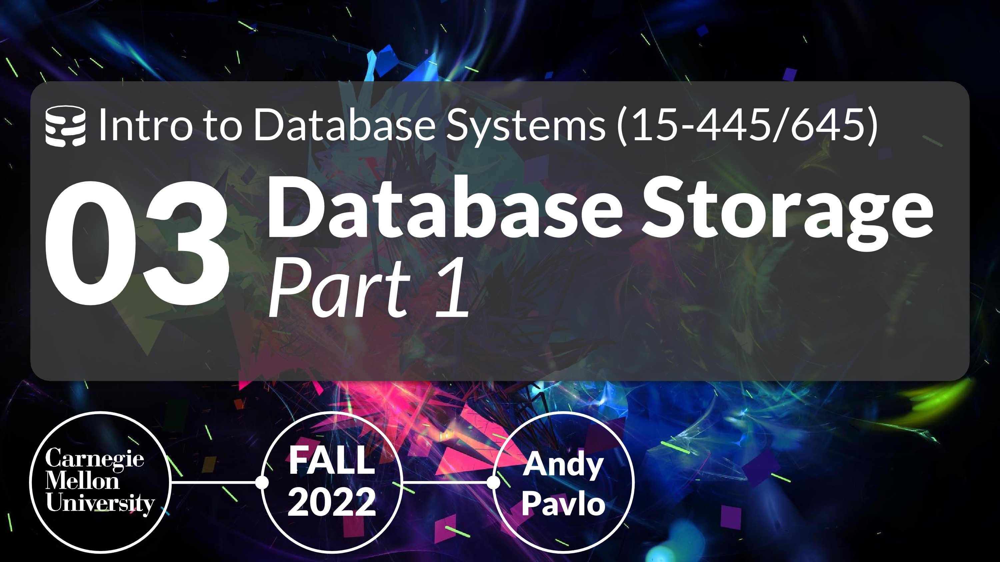
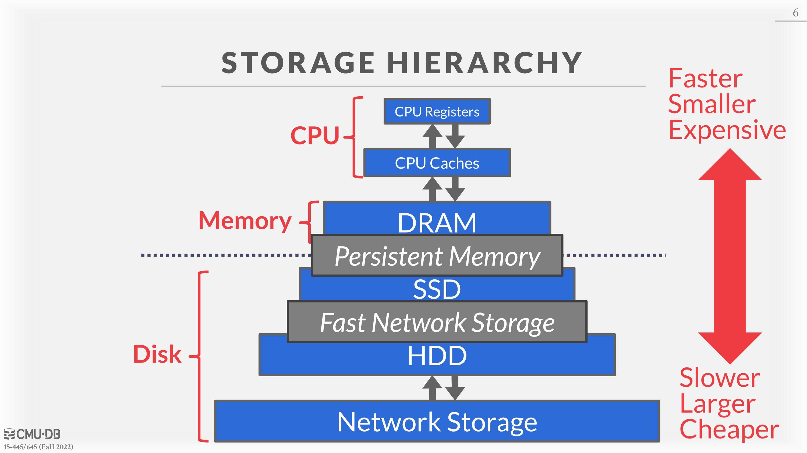
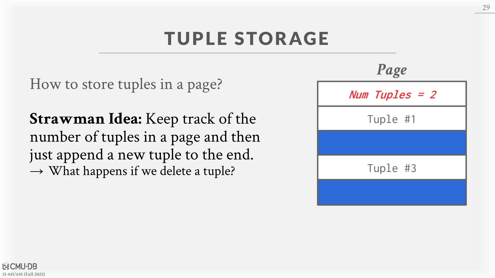

# 03 - Database Storage 1

# Storage

We will focus on a “disk-oriented” DBMS architecture that assumes that the primary storage location of the database is on non-volatile disk(s).

At the top of the storage hierarchy, you have the devices that are closest to the CPU. This is the fastest storage, but it is also the smallest and most expensive. The further you get away from the CPU, the larger but slower the storage devices get. These devices also get cheaper per GB.

**Volatile Devices:**

- Volatile means that if you pull the power from the machine, then the data is lost.
- **Volatile storage supports fast random access with byte-addressable locations.**  This means that the program can jump to any byte address and get the data that is there.
- For our purposes, we will always refer to this storage class as “memory.”

**Non-Volatile Devices:**

- Non-volatile means that the storage device does not require continuous power in order for the device to retain the bits that it is storing.
- It is also **block/page addressable.**  This means that in order to read a value at a particular offset, the program first has to load the 4 KB page into memory that holds the value the program wants to read.
- Non-volatile storage is traditionally better at sequential access (reading multiple contiguous chunks of data at the same time).
- We will refer to this as “disk.” We will not make a (major) distinction between solid-state storage (SSD) and spinning hard drives (HDD).

There is also a relatively new class of storage devices that are becoming more popular called *persistent memory*. These devices are designed to be the best of both worlds: **almost as fast as DRAM with the persistence of disk**. We will not cover these devices in this course, and they are currently not in widespread production use. Probably the most famous example is Optane; unfortunately Intel is winding down its production as of summer 2022. Note that you may see older references to persistent memory as “non-volatile memory”.

You may see references to NVMe SSDs, where NVMe stands for non-volatile memory express. These NVMe SSDs are not the same hardware as persistent memory modules. Rather, they are typical NAND flash drives that connect over an improved hardware interface. This improved hardware interface allows for much faster transfers, which leverages improvements in NAND flash perfomance.

Since our DBMS architecture assumes that the database is stored on disk, the components of the DBMS are responsible for figuring out how to move data between non-volatile disk and volatile memory since the system cannot operate on the data directly on disk.
We will focus on hiding the latency of the disk rather than optimizations with registers and caches since getting data from disk is so slow. If reading data from the L1 cache reference took one second, reading from an SSD would take 4.4 hours, and reading from an HDD would take 3.3 weeks.

# Disk-Oriented DBMS Overview

The database is all on disk, and the data in database files is organized into pages, with the first page being the **directory page**. To operate on the data, the DBMS needs to bring the data into memory. It does this by having a **buffer pool** that manages the data movement back and forth between disk and memory. The DBMS also has an **execution engine** that will execute queries. The execution engine will ask the buffer pool for a specific page, and the buffer pool will take care of bringing that page into memory and giving the execution engine a pointer to that page in memory. The buffer pool manager will ensure that the page is there while the execution engine operates on that part of memory.

# DBMS vs. OS

A high-level design goal of the DBMS is to support databases that exceed the amount of memory available. Since reading/writing to disk is expensive, disk use must be carefully managed. We do not want large stalls from fetching something from disk to slow down everything else. We want the DBMS to be able to process other queries while it is waiting to get the data from disk.
This high-level design goal is like virtual memory, where there is a large address space and a place for the OS to bring in pages from disk.
One way to achieve this virtual memory is by using `mmap` to map the contents of a file in a process’ address space, which makes the OS responsible for moving pages back and forth between disk and memory. **Unfortunately, this means that if **​ **`**mmap**`**​ ** hits a page fault, the process will be blocked.**

- You never want to use `mmap` in your DBMS if you need to write.
- The DBMS (almost) always wants to control things itself and can do a better job at it since it knows more about the data being accessed and the queries being processed.
- The operating system is not your friend.

TLB ( Translation Lookaside Buffer。MMU 为了加速查找页表，使用的 cache。用来加速 MMU 的转化速度)是从虚拟内存地址到物理内存地址转换的高速缓存。当处理器更改地址的虚拟到物理映射时，它需要告诉其他处理器在其缓存中使该映射无效。这个过程被称为"[TLB shootdowns](https://juejin.cn/post/6844904084957315086)"。
It is possible to use the OS by using:

- `madvise`: Tells the OS know when you are planning on reading certain pages.
- `mlock`: Tells the OS to not swap memory ranges out to disk.
- `msync`: Tells the OS to flush memory ranges out to disk.

We do not advise using `mmap` in a DBMS for correctness and performance reasons.
Even though the system will have functionalities that seem like something the OS can provide, having the DBMS implement these procedures itself gives it better control and performance.

# File Storage

In its most basic form, a DBMS stores a database as files on disk. Some may use a file hierarchy, others may use a single file (e.g., SQLite).
The OS does not know anything about the contents of these files. Only the DBMS knows how to decipher their contents, since it is encoded in a way specific to the DBMS.

The DBMS’s *storage manager* is responsible for managing a database’s files. It represents the files **as a collection of pages**. It also keeps track of what data has been read and written to pages as well how much free space there is in these pages.

# Database Pages

The DBMS organizes the database across one or more files in fixed-size blocks of data called pages. Pages can contain different kinds of data (tuples, indexes, etc). Most systems will not mix these types within pages. Some systems will require that pages are **self-contained**, meaning that all the information needed to read each page is on the page itself.
Each page is given a unique identifier. If the database is a single file, then the page id can just be the file offset. Most DBMSs have an indirection layer that **maps a page id to a file path and offset**. The upper levels of the system will ask for a specific page number. Then, the storage manager will have to turn that page number into a file and an offset to find the page.

Most DBMSs uses fixed-size pages to avoid the engineering overhead needed to support variable-sized pages. For example, with variable-size pages, deleting a page could create a hole in files that the DBMS cannot easily fill with new pages.
There are three concepts of pages in DBMS:

1. Hardware page (usually 4 KB).
2. OS page (4 KB).
3. Database page (1-16 KB).

**The storage device guarantees an atomic write of the size of the hardware page.**  If the hardware page is 4 KB and the system tries to write 4 KB to the disk, either all 4 KB will be written, or none of it will. This means that if our database page is larger than our hardware page, the DBMS will have to take extra measures to ensure that the data gets written out safely since the program can get partway through writing a database page to disk when the system crashes.

# Database Heap

There are a couple of ways to find the location of the page a DBMS wants on the disk, and **heap file** organization is one of those ways. A heap file is an unordered collection of pages where tuples are stored in random order.

The DBMS can locate a page on disk given a page id by using a **linked list** of pages or a page directory.

1. ** Linked List**: Header page holds pointers to a list of free pages and a list of data pages. However, if the DBMS is looking for a specific page, it has to do a sequential scan on the data page list until it finds the page it is looking for.
2. **Page Directory**: DBMS maintains special pages that track locations of data pages along with the amount of free space on each page.

# Page Layout

Every page includes a header that records meta-data about the page’s contents:

- Page size.
- Checksum.
- DBMS version.
- Transaction visibility.
- Self-containment. (Some systems like Oracle require this.)

A **strawman approach** to laying out data is to keep track of how many tuples the DBMS has stored in a page and then append to the end every time a new tuple is added. However, ***problems arise when tuples are deleted or when tuples have variable-length attributes***.
There are two **main approaches** to laying out data in pages: (1) **slotted-pages** and (2) **log-structured**.
**Slotted Pages:**  Page maps slots to offsets.

- Most common approach used in DBMSs today.
- Header keeps track of the number of used slots, the offset of the starting location of the last used slot, and a slot array, which keeps track of the location of the start of each tuple.
- To add a tuple, the slot array will grow from the beginning to the end, and the data of the tuples will grow from end to the beginning. The page is considered full when the slot array and the tuple data meet.

**Log-Structured:**  Covered in the next lecture.

# Tuple Layout

A tuple is essentially a sequence of bytes. It is the DBMS’s job to interpret those bytes into attribute types and values.

**Tuple Header:**  Contains meta-data about the tuple.

- Visibility information for the DBMS’s **concurrency control** protocol (i.e., information about which transaction created/modified that tuple).
- **Bit Map** for `NULL` values.
- Note that the DBMS **does not need to store meta-data about the schema** of the database here.

**Tuple Data:**  Actual data for attributes.

- Attributes are typically stored in the order that you specify them when you create the table.
- Most DBMSs do not allow a tuple to exceed the size of a page.

**Unique Identifier**:

- Each tuple in the database is assigned a unique identifier.
- Most common: `page_id + (offset or slot).`
- An application cannot rely on these ids to mean anything.

**Denormalized Tuple Data**: If two tables are related, the DBMS can “pre-join” them, so the tables end up on the same page. This makes reads faster since the DBMS only has to load in one page rather than two separate pages. However, it makes updates more expensive since the DBMS needs more space for each tuple.

