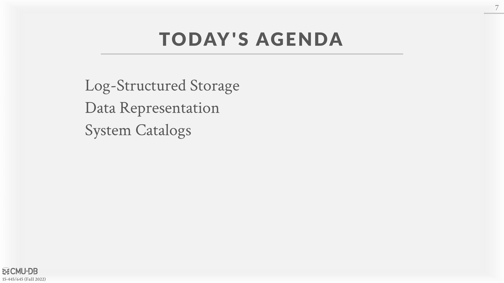
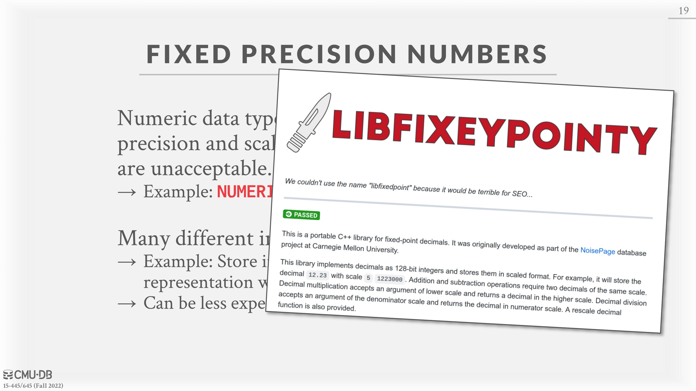
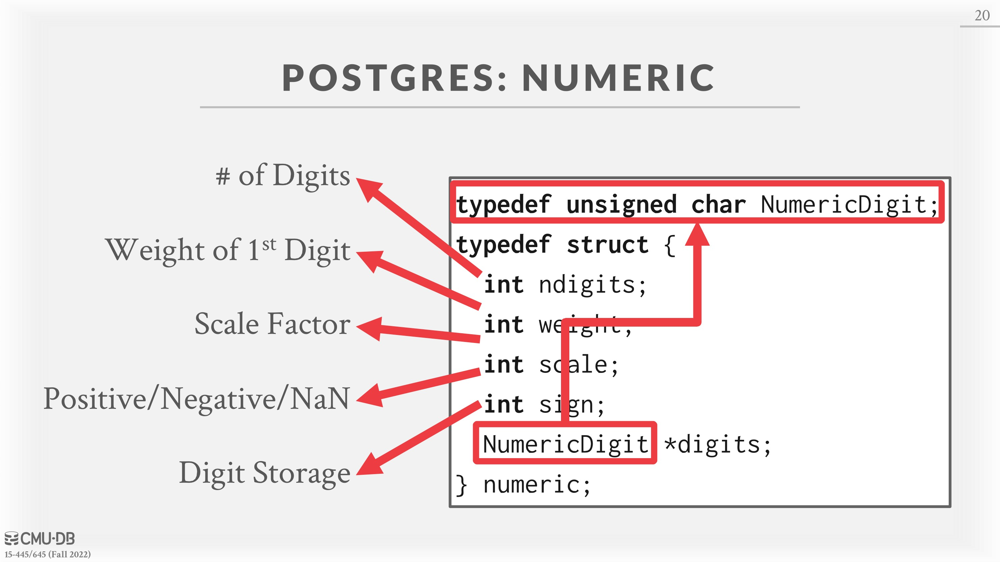
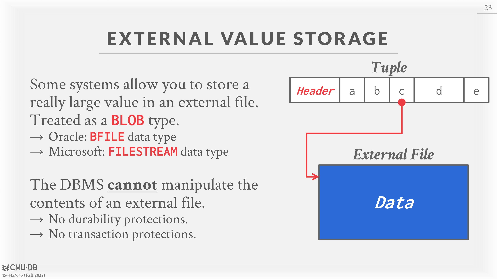
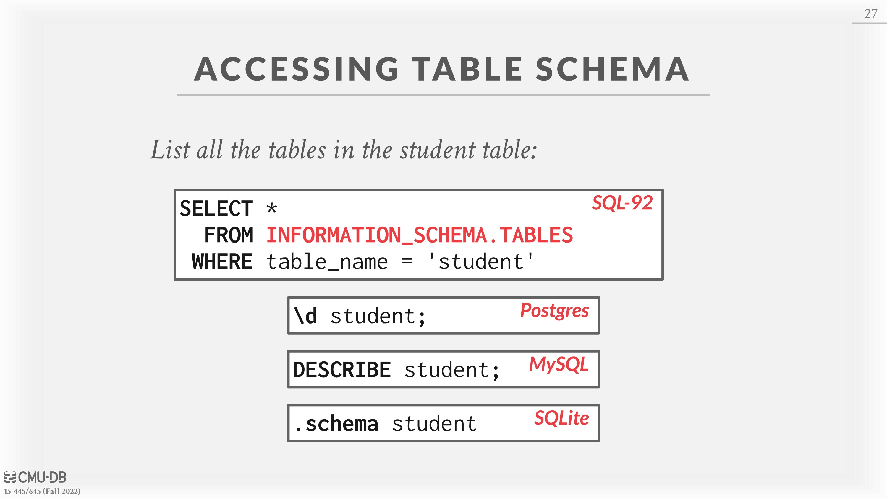

# 04 - Database Storage 2

# Log-Structured Storage

Some problems associated with the Slotted-Page Design are:

- Fragmentation: Deletion of tuples can leave gaps in the pages.
- Useless Disk I/O: Due to the block-oriented nature of non-volatile storage, the whole block needs to be read to fetch a tuple.
- Random Disk I/O: The disk reader could have to jump to 20 different places to update 20 different tuples, which can be very slow.

What if we were working on a system which only allows creation of new data and no overwrites? The log-structured storage model works with this assumption and addresses some of the problems listed above.

**Log-Structured Storage**: Instead of storing tuples, the DBMS only stores log records.

- Stores records to file of how the database was modified (put and delete). Each log record contains the tuple’s unique identifier.
- To read a record, the DBMS scans the log file backwards from newest to oldest and “recreates” the tuple.
- Fast writes, potentially slow reads. Disk writes are sequential and existing pages are immutable which leads to reduced random disk I/O.
- Works well on append-only storage because the DBMS cannot go back and update the data.
- To avoid long reads, the DBMS can have **indexes** to allow it to jump to specific locations in the log. It can also periodically compact the log. (If it had a tuple and then made an update to it, it could compact it down to just inserting the updated tuple.)
- The database can compact the log into a table **sorted by the id **since the temporal information is not needed anymore. These are called Sorted String Tables (SSTables) and they can make the tuple search very fast.
- **The issue with compaction is that the DBMS ends up with write amplification**. (It re-writes the same data over and over again.)

# Data Representation

The data in a tuple is essentially just byte arrays. It is up to the DBMS to know how to interpret those bytes to derive the values for attributes. A ***data representation***** scheme** is how a DBMS stores the bytes for a value.
There are five high level datatypes that can be stored in tuples: integers, variable-precision numbers, fixed-point precision numbers, variable length values, and dates/times.

## Integers

Most DBMSs store integers using their “native” C/C++ types as specified by the IEEE-754 standard. These values are fixed length.
Examples: `INTEGER`, `BIGINT`, `SMALLINT`, `TINYINT`.

## Variable Precision Numbers

These are inexact, variable-precision numeric types that use the “native” C/C++ types specified by IEEE-754 standard. These values are also fixed length.
Operations on variable-precision numbers are faster to compute than arbitrary precision numbers because the CPU can execute instructions on them directly. However, there may be rounding errors when performing computations due to the fact that some numbers cannot be represented precisely.
Examples: `FLOAT`, `REAL`.

## Fixed-Point Precision Numbers

These are numeric data types **with arbitrary precision and scale**. They are typically stored in exact, variable-length binary representation (almost like a string) with additional meta-data that will tell the system things like the length of the data and where the decimal should be.
These data types are used when rounding errors are unacceptable, but the DBMS pays a performance penalty to get this accuracy.
Examples: `NUMERIC`, `DECIMAL`.

# Variable-Length Data

These represent data types of arbitrary length. They are typically stored with a **header** that keeps track of the length of the string to make it easy to jump to the next value. It may also contain a **checksum** for the data.
Most DBMSs do not allow a tuple to exceed the size of a single page. The ones that do store the data on a special “overflow” page and have the tuple contain a reference to that page. These *overflow pages can contain pointers* to additional overflow pages until all the data can be stored.
Some systems will let you store these large values in an **external file**, and then the tuple will contain a pointer to that file. For example, if the database is storing photo information, the DBMS can store the photos in the external files rather than having them take up large amounts of space in the DBMS. One downside of this is that the DBMS cannot manipulate the contents of this file. Thus, there are **no durability or transaction protections**.
Examples: `VARCHAR`, `VARBINARY`, `TEXT`, `BLOB`.

# Dates and Times

Representations for date/time vary for different systems. Typically, these are represented as some unit time (micro/milli)seconds since the unix epoch.
Examples: `TIME`, `DATE`, `TIMESTAMP`.

# System Catalogs

In order for the DBMS to be able to decipher the contents of tuples, it maintains an internal **catalog to tell it meta-data about the databases.**  The meta-data will contain information about what tables and columns the databases have along with their types and the orderings of the values.
Most DBMSs store their catalog inside of themselves in the format that they use for their tables. They use special code to “bootstrap” these catalog tables.

