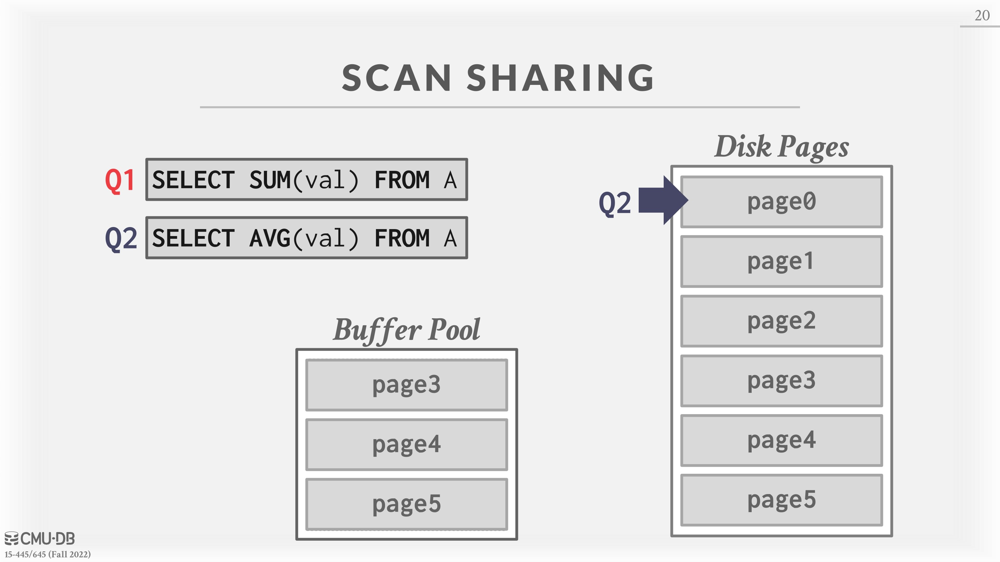
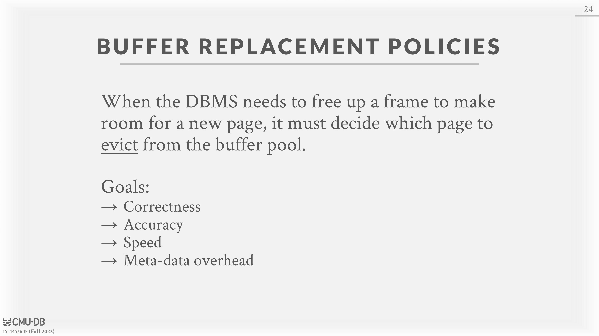
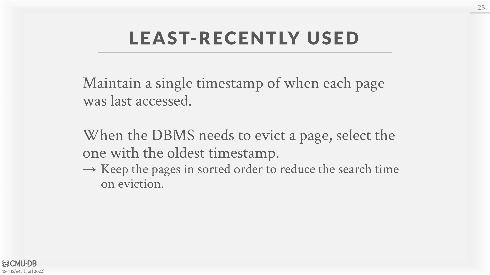

# 06 - Memory Management + Buffer Cache

# Introduction

The DBMS is responsible for managing its memory and moving data back-and-forth from the disk. Since, for the most part, data cannot be directly operated on in the disk, any database must be able to efficiently move data represented as files on its disk into memory so that it can be used. A diagram of this interaction is shown in Figure 1. A obstacle that DBMS’s face is the problem of minimizing the slowdown of moving data around. Ideally, it should “appear” as if the data is all in the memory already. The **execution engine** shouldn’t have to worry about how data is fetched into memory.

Another way to think of this problem is in terms of spatial and temporal control.
*Spatial Control* refers to where pages are physically written on disk. The goal of spatial control is to keep pages that are used together often as physically close together as possible on disk.
*Temporal Control* refers to when to read pages into memory and when to write them to disk. Temporal control aims to minimize the number of stalls from having to read data from disk.

# Locks vs. Latches

We need to make a distinction between locks and latches when discussing how the DBMS protects its internal elements.
**Locks: **A lock is a higher-level, logical primitive that protects the contents of a database (e.g., tuples, tables, databases) from other transactions. Transactions will hold a lock for its entire duration. Database systems can expose to the user which locks are being held as queries are run. Locks need to be able to rollback changes.
**Latches:**  A latch is a low-level protection primitive that the DBMS uses for the critical sections in its internal data structures (e.g., hash tables, regions of memory). Latches are held for only the duration of the operation being made. Latches do not need to be able to rollback changes.

# Buffer Pool

The *buffer pool* is an in-memory cache of pages read from disk. It is essentially a large memory region allocated inside of the database to store pages that are fetched from disk.
The buffer pool’s region of memory organized as an array of **fixed size pages.**  Each array entry is called a **frame**. When the DBMS requests a page, an exact copy is placed into one of the frames of the buffer pool. Then, the database system can search the buffer pool first when a page is requested. If the page is not found, then the system fetches a copy of the page from the disk. Dirty pages are buffered and not written back immediately（write-back cache）. See Figure 2 for a diagram of the buffer pool’s memory organization.

## Buffer Pool Meta-data

The buffer pool must maintain certain meta-data in order to be used efficiently and correctly.
Firstly, the *page table* is an in-memory hash table that keeps track of pages that are currently in memory. It maps page ids to frame locations in the buffer pool. Since the order of pages in the buffer pool does not necessarily reflect the order on the disk, this extra indirection layer allows for the identification of page locations in the pool.
**Note: **The **page table** is not to be confused with the **page directory**, which is the mapping from page ids to page locations in database files. All changes to the page directory must be recorded on disk to allow the DBMS to find on restart.
The page table also maintains additional meta-data per page, a dirty-flag and a pin/reference counter.

The *dirty-flag* is set by a thread whenever it modifies a page. This indicates to storage manager that the page must be written back to disk.
The *pin/reference* Counter tracks the number of threads that are currently accessing that page (either reading or modifying it). A thread has to increment the counter before they access the page. If a page’s count is greater than zero, then the storage manager is **not** allowed to evict that page from memory.

## Memory Allocation Policies

Memory in the database is allocated for the buffer pool according to two policies.
*Global policies* deal with decisions that the DBMS should make to benefit the entire workload that is being executed. It considers all active transactions to find an optimal decision for allocating memory.
An alternative is *local policies*, which makes decisions that will make a single query or transaction run faster, even if it isn’t good for the entire workload. Local policies allocate frames to a specific transactions without considering the behavior of concurrent transactions.
Most systems use a combination of both global and local views.

# Buffer Pool Optimizations

There are a number of ways to optimize a buffer pool to tailor it to the application’s workload.

## Multiple Buffer Pools

The DBMS can maintain multiple buffer pools for different purposes (i.e per-database buffer pool, per-page type buffer pool). Then, each buffer pool can adopt local policies tailored for the data stored inside of it. This method can help reduce latch contention and improves locality.
Two approaches to mapping desired pages to a buffer pool are object IDs and hashing.
_Object IDs _involve extending the record IDs to have an object identifier. Then through the object identifier, a mapping from objects to specific buffer pools can be maintained.
Another approach is *hashing* where the DBMS hashes the page id to select which buffer pool to access.

bufferpool -> tablespace -> table

## Pre-fetching

The DBMS can also optimize by pre-fetching pages based on the query plan. Then, while the first set of pages is being processed, the second can be pre-fetched into the buffer pool. This method is commonly used by DBMS’s when accessing many pages sequentially.

## Scan Sharing (Synchronized Scans)

Query cursors can reuse data retrieved from storage or operator computations. This allows multiple queries to attach to a single cursor that scans a table. Ifb a query starts a scan and if there one already doing this, then the DBMS will attach the second query’s cursor to the existing cursor. The DBMS keeps track of where the second query joined with the first so that it can finish the scan when it reaches the end of the data structure.

Problems that Synchronized Scans might incur:

## Buffer Pool Bypass

The sequential scan operator will not store fetched pages in the buffer pool to avoid overhead. Instead, memory is local to the running query. This works well if operator needs to read a large sequence of pages that are contiguous on disk. Buffer Pool Bypass can also be used for temporary data (sorting, joins).

# OS Page Cache

Most disk operations go through the OS API. Unless explicitly told otherwise, the OS maintains its own filesystem cache.
Most DBMS use **direct I/O to bypass the OS’s cache** in order to avoid redundant copies of pages and having to manage different eviction policies.
**Postgres** is an example of a database system that uses the OS’s Page Cache.

# Buffer Replacement Policies

When the DBMS needs to free up a frame to make room for a new page, it must decide which page to evict from the buffer pool.
A replacement policy is an algorithm that the DBMS implements that makes a decision on which pages to evict from buffer pool when it needs space.
Implementation goals of replacement policies are improved correctness, accuracy, speed, and meta-data overhead.

## Least Recently Used (LRU)

The Least Recently Used replacement policy maintains a timestamp of when each page was last accessed. The DBMS picks to evict the page with the oldest timestamp. This timestamp can be stored in a separate data structure, such as a queue, to allow for sorting and improve efficiency by reducing sort time on eviction.

## CLOCK

The CLOCK policy is an approximation of LRU without needing a separate timestamp per page. In the CLOCK policy, each page is given a **reference bit**. When a page is accessed, set to 1.
To visualize this, organize the pages in a circular buffer with a “clock hand”. Upon sweeping check if a page’s bit is set to 1. If yes, set to zero, if no, then evict it. In this way, the clock hand remembers position between evictions.

## Alternatives

There are a number of problems with LRU and CLOCK replacement policies.
Namely, LRU and CLOCK are susceptible to *sequential flooding*, where the buffer pool’s contents are corrupted due to a sequential scan. Since sequential scans read every page, the timestamps of pages read may not reflect which pages we actually want. In other words, the most recently used page is actually the most unneeded page.
There are three solutions to address the shortcomings of LRU and CLOCK policies.
One solution is **LRU-K **which tracks the history of the last K references as timestamps and computes the interval between subsequent accesses. This history is used to predict the next time a page is going to be accessed.

Another optimization is localization per query. The DBMS chooses which pages to evict on a per transaction/query basis. This minimizes the pollution of the buffer pool from each query.

Lastly, priority hints allow transactions to tell the buffer pool whether page is important or not based on the context of each page during query execution.

## Dirty Pages

There are two methods to handling pages with dirty bits. The fastest option is to drop any page in the buffer pool that is not dirty. A slower method is to write back dirty pages to disk to ensure that its changes are persisted.
These two methods illustrate the trade-off between fast evictions versus dirty writing pages that will not be read again in the future.

One way to avoid the problem of having to write out pages unnecessarily is background writing. Through background writing, the DBMS can periodically walk through the page table and write dirty pages to disk. When a dirty page is safely written, the DBMS can either evict the page or just unset the dirty flag.

# Other Memory Pools

The DBMS needs memory for things other than just tuples and indexes. These other memory pools may not always backed by disk depending on implementation.

- Sorting + Join Buffers
- Query Caches
- Maintenance Buffers
- Log Buffers
- Dictionary Caches

