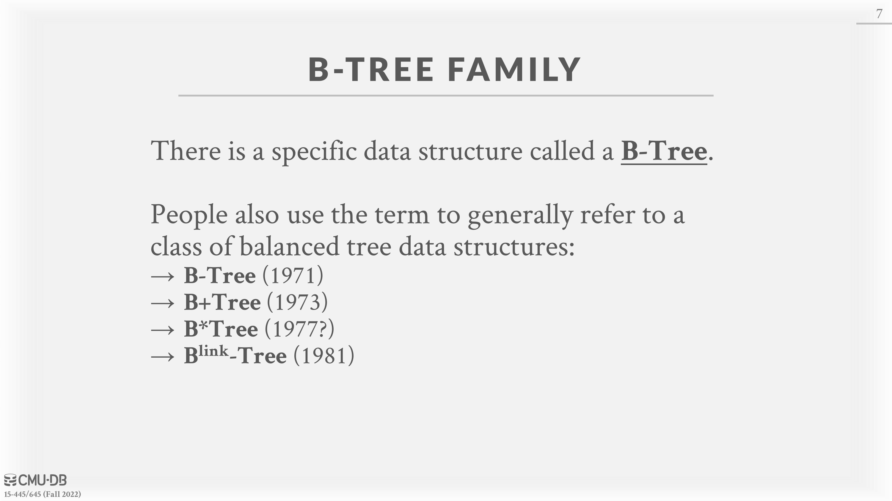
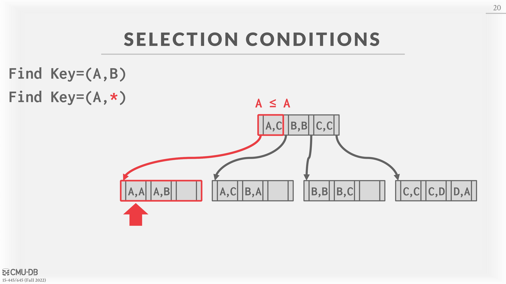
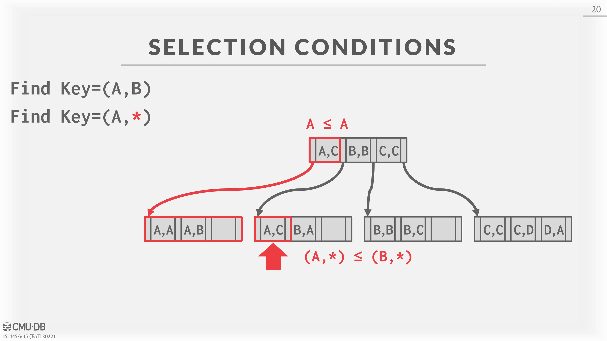

# 08 - B+Tree Indexes

## Table Indexes

There are a number of different data structures one can use inside of a database system for purposes such as **internal meta-data, core data storage, temporary data structures**, or **table indexes**. For table indexes, which may involve queries with range scans, A _table index_ is a replica of a subset of a table’s columns that is organized and/or sorted for efficient access using a subset of those attributes. So instead of performing a sequential scan, the DBMS can lookup the table index’s auxiliary data structure to find tuples more quickly. The DBMS ensures that the contents of the tables and the indexes are always logically in sync.

There exists a trade-off between the number of indexes to create per database. Although more indexes makes looking up queries faster, indexes also use storage and require maintenance. It is the DBMS’s job to figure out the best indexes to use to execute queries.

## B+Tree

A _B+Tree_ is a self-balancing tree data structure that keeps data sorted and allows searches, sequential access, insertion, and deletions in $O(log(n))$. It is optimized for disk-oriented DBMS’s that read/write large blocks of data.

Almost every modern DBMS that supports order-preserving indexes uses a B+Tree. There is a specific data structure called a B-Tree, but people also use the term to generally refer to a class of data structures. The primary difference between the original B-Tree and the B+Tree is that B-Trees stores keys and values in all nodes, while B+ trees store values only in leaf nodes. Modern B+Tree implementations combine features from other B-Tree variants, such as the sibling pointers used in the $B^{link} -Tree$.

Formally, a B+Tree is an M-way search tree (where M represents the maximum number of children a node can have) with the following properties:

* It is perfectly balanced (i.e., every leaf node is at the same depth).
* Every **inner node** other than the root is at least half full (M/2 − 1 <= num of keys <= M − 1).
* Every inner node with k keys has k+1 non-null children.

Every node in a B+Tree contains an array of key/value pairs. The keys in these pairs are derived from the attribute(s) that the index is based on. The values will differ based on whether a node is an inner node or a leaf node. For inner nodes, the value array will contain pointers to other nodes. Two approaches for leaf node values are record IDs and tuple data. **Record IDs** refer to a pointer to the location of the tuple. Leaf nodes that have **tuple data** store the the actual contents of the tuple in each node.

Figure 1: B+ Tree diagram

Though it is not necessary according to the definition of the B+Tree, arrays at every node are almost always sorted by the keys.

Conceptually, the keys on the inner nodes can be thought of as guide posts. They guide the tree traversal but do not represent the keys (and hence their values) on the leaf nodes. What this means is that you could potentially have a key in an inner node (as a guide post) that is not found on the leaf nodes. Although it must be noted that conventionally inner nodes possess only those keys that are present in the leaf nodes.

## Insertion

To insert a new entry into a B+Tree, one must traverse down the tree and use the inner nodes to figure out which leaf node to insert the key into.

1. Find correct leaf L.
2. Add new entry into L in sorted order:

* If L has enough space, the operation is done.
* Otherwise split L into two nodes L and L2 .
  * Redistribute entries evenly and copy up middle key.
  * Insert index entry pointing to L2 into parent of L.

1. To split an inner node, redistribute entries evenly, but \*\*push up \*\*the middle key.

[B+ Trees Visualization](https://dichchankinh.com/\~galles/visualization/BPlusTree.html)

## Deletion

Whereas in inserts we occasionally had to split leaves when the tree got too full, if a deletion causes a tree to be less than half-full, we must merge in order to re-balance the tree.

1. Find correct leaf L.
2. Remove the entry:

* If L is at least half full, the operation is done.
* Otherwise, you can try to redistribute, borrowing from sibling.
* If redistribution fails, merge L and sibling.

1. If merge occurred, you must delete entry in parent pointing to L.

## Selection Conditions

Because B+Trees are in sorted order, look ups have fast traversal and also do not require the entire key. The DBMS can use a B+Tree index if the query provides any of the attributes of the search key. This differs from a hash index, which requires all attributes in the search key.

### Non-Unique Indexes

Like in hash tables, B+Trees can deal with non-unique indexes by duplicating keys or storing value lists. In the **duplicate keys** approach, the same leaf node layout is used but duplicate keys are stored multiple times. In the **value lists** approach, each key is stored only once and maintains a linked list of unique values.

Figure 2: To perform a prefix search on a B+Tree, one looks at the first attribute on the key, follows the path down and performs a sequential scan across the leaves to find all they keys that one wants.

### Duplicate Keys

There are two approaches to duplicate keys in a B+Tree. The first approach is to **append record IDs as part of the key.** Since each tuple’s record ID is unique, this will ensure that all the keys are identifiable. The second approach is to **allow leaf nodes to spill into overflow nodes** that contain the duplicate keys. Although no redundant information is stored, this approach is more complex to maintain and modify.

### Clustered Indexes

The table is stored in the sort order specified by the primary key, as either heap- or index-organized storage. Since some DBMSs always use a clustered index, they will automatically make a hidden row id primary key if a table doesn’t have an explicit one, but others cannot use them at all.

### Heap Clustering

Tuples are sorted in the heap’s pages using the order specified by a clustering index. DBMS can jump directly to the pages if clustering index’s attributes are used to access tuples.

### Index Scan Page Sorting

Since directly retrieving tuples from an unclustered index is inefficient, the DBMS can first figure out all the tuples that it needs and then sort them based on their page id.

## B+Tree Design Choices

### Node Size

**Depending on the storage medium**, we may prefer larger or smaller node sizes. For example, nodes stored on hard drives are usually on the order of megabytes in size to reduce the number of seeks needed to find data and amortize the expensive disk read over a large chunk of data, while in-memory databases may use page sizes as small as 512 bytes in order to fit the entire page into the CPU cache as well as to decrease data fragmentation. This choice can also be dependent on the type of workload, as point queries would prefer as small a page as possible to reduce the amount of unnecessary extra info loaded, while a large sequential scan might prefer large pages to reduce the number of fetches it needs to do.

### Merge Threshold

While B+Trees have a rule about merging underflowed nodes after a delete, sometimes it may be beneficial to temporarily violate the rule to reduce the number of deletion operation. For instance, eager merging could lead to thrashing, where a lot of successive delete and insert operations lead to constant splits and merges. It also allows for **batched merging** where multiple merge operations happen all at once, reducing the amount of time that expensive write latches have to be taken on the tree.

### Variable Length Keys

Currently we have only discussed B+Trees with fixed length keys. However we may also want to support variable length keys, such as the case where a small subset of large keys lead to a lot of wasted space. There are several approaches to this:

1. **Pointers** Instead of storing the keys directly, we could just store a pointer to the key. Due to the inefficiency of having to chase a pointer for each key, the only place that uses this method in production is _embedded devices_, where its tiny registers and cache may benefit from such space savings
2. \*\*Variable Length Nodes \*\*We could also still store the keys like normal and allow for variable length nodes. This is infeasible and largely not used due to the significant memory management overhead of dealing with variable length nodes.
3. **Padding** Instead of varying the key size, we could set each key’s size to the size of the maximum key and pad out all the shorter keys. In most cases this is a massive waste of memory, so you don’t see this used by anyone either.
4. **Key Map/Indirection** The method that nearly everyone uses is replacing the keys with an index to the key-value pair in a separate dictionary. This offers significant space savings and potentially shortcuts point queries (since the key-value pair the index points to is the exact same as the one pointed to by leaf nodes). Due to the small size of the dictionary index value, there is enough space to place a prefix of each key alongside the index, potentially allowing some index searching and leaf scanning to not even have to chase the pointer (if the prefix is at all different from the search key).

> **Pointer chasing** refers to a common sequence of instructions that involves a repeated series of irregular [memory access patterns](https://en.wikichip.org/w/index.php?title=memory\_access\_patterns\&action=edit\&redlink=1) that require the accessed data to determine the subsequent pointer address to be accessed, forming a serially-dependent chain of loads.

## Intra-Node Search

Once we reach a node, we still need to search within the node (either to find the next node from an inner node, or to find our key value in a leaf node). While this is relatively simple, there are still some tradeoffs to consider:

1. **Linear** The simplest solution is to just scan every key in the node until we find our key. On the one hand, we don’t have to worry about sorting the keys, making insertions and deletes much quicker. On the other hand, this is relatively inefficient and has a complexity of $O(n)$ per search. This can be vectorized using SIMD (or equivalent) instructions.
2. **Binary** A more efficient solution for searching would be to keep each node sorted and use binary search to find the key. This is as simple as jumping to the middle of a node and pivoting left or right depending on the comparison between the keys. Searches are much more efficient this way, as this method only has the complexity of $O(ln(n))$ per search. However, insertions become more expensive as we must maintain the sort of each node.
3. **Interpolation** Finally, in some circumstances we may be able to utilize interpolation to find the key. This method takes advantage of any metadata stored about the node (such as max element, min element, average, etc.) and uses it to generate an approximate location of the key. For example, if we are looking for 8 in a node and we know that 10 is the max key and $10 − (n + 1)$ is the smallest key (where n is the number of keys in each node), then we know to start searching 2 slots down from the max key, as the key one slot away from the max key must be 9 in this case. Despite being the fastest method we have given, this method is only seen in academic databases due to its limited applicability to keys with certain properties (like integers) and complexity.

## Optimizations

### Prefix Compression

Most of the time when we have keys in the same node there will be some partial overlap of some prefix of each key (as **similar keys will end up right next to each other** in a sorted B+Tree). Instead of storing this prefix as part of each key multiple times, we can simply store the prefix once at the beginning of the node and then only include the unique sections of each key in each slot.

### Deduplication

In the case of an index which allows non-unique keys, we may end up with leaf nodes containing the same key over and over with different values attached. One optimization of this could be only writing the key once and then following it with all of its associated values.

### Suffix Truncation

For the most part the key entries in inner nodes are just used as signposts and not for their actual key value (as even if a key exists in the index we still have to search to the bottom to ensure that it hasn’t been deleted). We can take advantage of this by only storing the **minimum prefix that is needed to correctly route** probes into the correct node.

### Pointer Swizzling

Because each node of a B+Tree is stored in a page from the buffer pool, each time we load a new page we need to fetch it from the buffer pool, requiring latching and lookups. To skip this step entirely, we could **store the actual raw pointers in place of the page IDs** (known as ”**swizzling**”), preventing a buffer pool fetch entirely. Rather than manually fetching the entire tree and placing the pointers manually, we can simply store the resulting pointer from a page lookup when traversing the index normally. Note that we must track which pointers are swizzled and deswizzle them back to page ids when the page they point to is unpinned and victimized.

### Bulk Insert

When a B+Tree is initially built, having to insert each key the usual way would lead to constant split operations. Since we already give leaves sibling pointers, initial insertion of data is much more efficient if we construct a sorted linked list of leaf nodes and then easily build the index from the bottom up using the first key from each leaf node. Note that depending on our context we may wish to pack the leaves as tightly as possible to save space or leave space in each leaf to allow for more inserts before a split is necessary.

