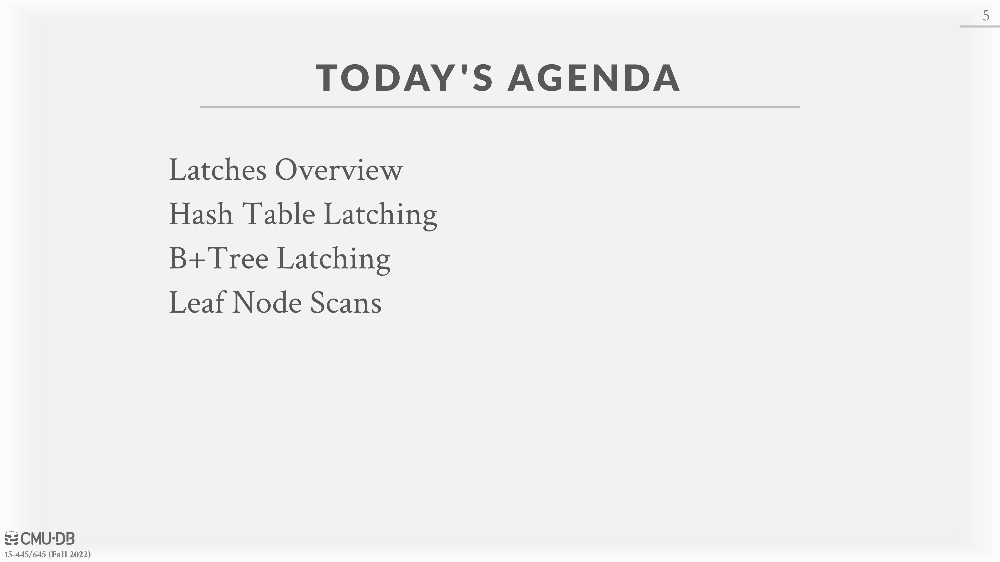
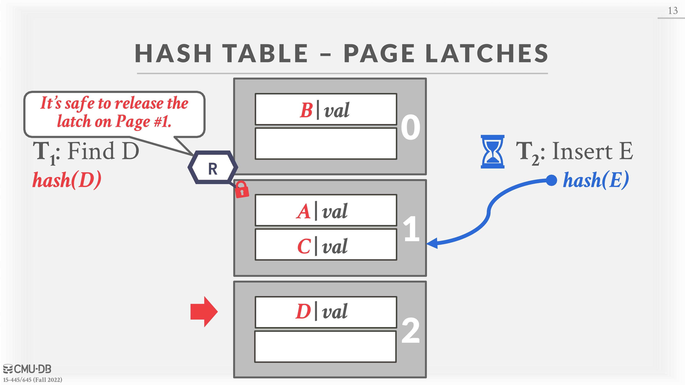
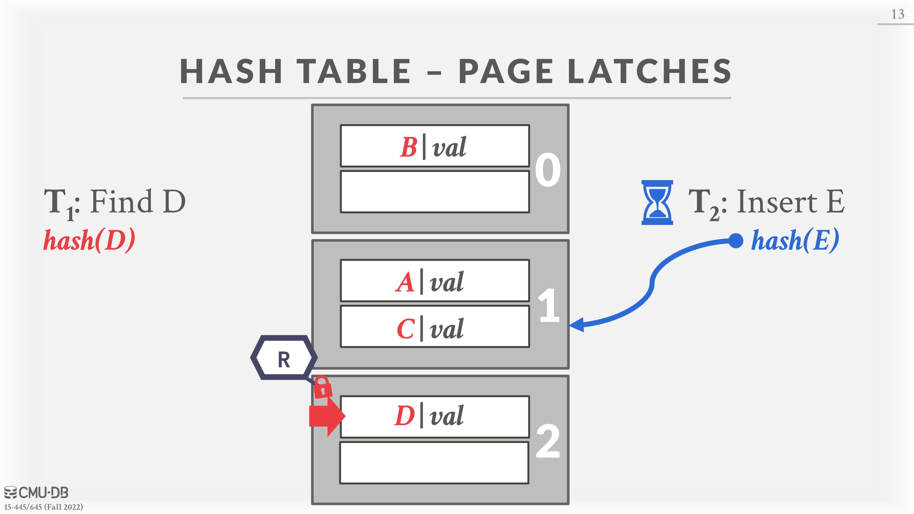

# 09 - Concurrent Indexes

## Index Concurrency Control

So far, we assumed that the data structures we have discussed are single-threaded. However, most DBMSs needs to allow multiple threads to safely access data structures to take advantage of additional CPU cores and hide disk I/O stalls. A _concurrency control_ protocol is the method that the DBMS uses to ensure “correct” results for concurrent operations on a shared object. A protocol’s correctness criteria can vary:

* **Logical Correctness**: This means that the thread is able to read values that it should expects to read, e.g. a thread should read back the value it had written previously.
* **Physical Correctness**: This means that the internal representation of the object is sound, e.g. there are not pointers in the data structure that will cause a thread to read invalid memory locations.

For the purposes of this lecture, we only care about enforcing **physical correctness**. We will revisit logical correctness in later lectures.

## Locks vs. Latches

There is an important distinction between locks and latches when discussing how the DBMS protects its internal elements.

### Locks

A lock is a higher-level, logical primitive that protects the contents of a database (e.g., tuples, tables, databases) from other transactions. Transactions will hold a lock for its entire duration. Database systems can expose to the user the locks that are being held as queries are run. **Locks need to be able to rollback changes.**

### Latches

Latches are the low-level protection primitives used for critical sections the DBMS’s internal data structures (e.g., data structure, regions of memory) from other threads. Latches are held for only the duration of the operation being made. Latches do not need to be able to rollback changes. There are two modes for latches:

* **READ:** Multiple threads are allowed to read the same item at the same time. A thread can acquire the read latch even if another thread has acquired it as well.
* \*\*WRITE: \*\*Only one thread is allowed to access the item. A thread cannot acquire a write latch if another thread holds the latch in any mode. A thread holding a write latch also prevents other threads from acquiring a read latch.

## Latch Implementations

The underlying primitive that used to implement a latch is through an atomic compare-and-swap (**CAS**) instruction that modern CPUs provide. With this, a thread can check the contents of a memory location to see whether it has a certain value. If it does, then the CPU will swap the old value with a new one. Otherwise the memory location remains unmodified. There are several approaches to implementing a latch in a DBMS. Each approach has different trade-offs in terms of engineering complexity and runtime performance. These test-and-set steps are performed atomically (i.e., no other thread can update the value in between the test and set steps.

### Blocking OS Mutex

One possible implementation of latches is the OS built-in mutex infrastructure. Linux provides the `**futex**` (fast user-space mutex), which is comprised of (1) a spin latch in user-space and (2) an OS-level mutex. If the DBMS can acquire the user-space latch, then the latch is set. _It appears as a single latch to the DBMS even though it contains two internal latches._ If the DBMS fails to acquire the user-space latch, then it goes down into the kernel and tries to acquire a more expensive mutex. If the DBMS fails to acquire this second mutex, then the thread notifies the OS that it is blocked on the mutex and then it is descheduled. **OS mutex is generally a bad idea** inside of DBMSs as it is managed by OS and has large overhead.

* **Example**: `std::mutex`
* **Advantages**: Simple to use and requires no additional coding in DBMS.
* **Disadvantages**: Expensive and non-scalable (about 25 ns per lock/unlock invocation) because of OS scheduling.

### Reader-Writer Latches

Mutexes and Spin Latches do not differentiate between reads/writes (i.e., they do not support different modes). The DBMS needs a way to allow for concurrent reads, so if the application has heavy reads it will have better performance because readers can share resources instead of waiting. A Reader-Writer Latch allows a latch to be held in either read or write mode. It keeps track of how many threads hold the latch and are waiting to acquire the latch in each mode. Reader-writer latches use one of the previous two latch implementations as primitives and have additional logic to handle **reader-writer queues**, which are queues requests for the latch in each mode. Different DBMSs can have different policies for how it handles the queues.

* **Example**: `std::shared mutex`
* **Advantages**: Allows for concurrent readers.
* **Disadvantages**: The DBMS has to manage read/write queues to avoid starvation. Larger storage overhead than spin Latches due to additional meta-data.

### Test-and-Set Spin Latch (TAS)

Spin latches are a more efficient alternative to an OS mutex as it is controlled by the DBMSs. A spin latch is essentially a location in memory that threads try to update (e.g., setting a boolean value to true). A thread performs CAS to attempt to update the memory location. The DBMS can control what happens if it fails to get the latch. It can choose to try again (for example, using a while loop) or allow the OS to deschedule it. Thus, this method gives the DBMS more control than the OS mutex, where failing to acquire a latch gives control to the OS.

* **Example**: `std::atomic<T>`
* **Advantages**: Latch/unlatch operations are efficient (single instruction to lock/unlock).
* **Disadvantages**: Not scalable nor cache-friendly because with multiple threads, the CAS instructions will be executed multiple times in different threads. These wasted instructions will pile up in high contention environments; the threads look busy to the OS even though they are not doing useful work. This leads to cache coherence problems because threads are polling cache lines on other CPUs.

## Hash Table Latching

It is easy to support concurrent access in a static hash table due to the limited ways threads access the data structure. For example, all threads move in the same direction when moving from slot to the next (i.e., top-down). Threads also only access a single page/slot at a time. Thus, deadlocks are not possible in this situation because no two threads could be competing for latches held by the other. When we need to resize the table, we can just take a global latch on the entire table to perform the operation. Latching in a dynamic hashing scheme (e.g., extendible) is a more complicated scheme because there is more shared state to update, but the general approach is the same.

There are two approaches to support latching in a hash table that differ on the granularity of the latches:

* **Page Latches**: Each page has its own Reader-Writer latch that protects its entire contents. Threads acquire either a read or write latch before they access a page. This decreases parallelism because potentially only one thread can access a page at a time, but accessing multiple slots in a page will be fast for a single thread because it only has to acquire a single latch.
* **Slot Latches**: Each slot has its own latch. This increases parallelism because two threads can access different slots on the same page. But it increases the storage and computational overhead of accessing the table because threads have to acquire a latch for every slot they access, and each slot has to store data for the latches. The DBMS can use a single mode latch (i.e., Spin Latch) to reduce meta-data and computational overhead at the cost of some parallelism.

It is also possible to create a \*\*latch-free linear probing hash table \*\*directly using compare-and-swap (CAS) instructions. Insertion at a slot can be achieved by attempting to compare-and-swap a special “null” value with the tuple we wish to insert. If this fails, we can probe the next slot, continuing until it succeeds.

## B+Tree Latching

The challenge of B+Tree latching is preventing the two following problems:

* Threads trying to modify the contents of a node at the same time.
* One thread traversing the tree while another thread splits/merges nodes.

Latch crabbing/coupling is a protocol to allow multiple threads to access/modify B+Tree at the same time. The basic idea is as follows.

1. Get latch for the parent.
2. Get latch for the child.
3. Release latch for the parent **if the child is deemed “safe”** . A “safe” node is one that will not split, merge, or redistribute when updated.

Note that the notion of “safe” depends on whether the operation is an insertion or a deletion. A full node is “safe” for deletion since a merge will not be needed but is not “safe” for an insertion since we may need to split the node. Note that read latches do not need to worry about the “safe” condition.

### Basic Latch Crabbing Protocol:

* \*\*Search: \*\*Start at the root and go down, repeatedly acquire latch on the child and then unlatch parent.
* **Insert/Delete:** Start at the root and go down, obtaining `X` latches as needed. Once the child is latched, check if it is safe. If the child is safe, release latches on all its ancestors.

The order in which latches are released is not important from a correctness perspective. However, from a performance point of view, it is better to release the latches that are higher up in the tree since they block access to a larger portion of leaf nodes.

### Improved Latch Crabbing Protocol:

The problem with the basic latch crabbing algorithm is that transactions always acquire an exclusive latch on the root for every insert/delete operation. This limits parallelism. Instead, one can assume that having to resize (i.e., split/merge nodes) is rare, and thus transactions can acquire shared latches down to the leaf nodes. Each transaction will assume that the path to the target leaf node is safe, and use `READ` latches and crabbing to reach it and verify. If the leaf node is not safe, then we abort and do the previous algorithm where we acquire `WRITE` latches.

* **Search:** Same algorithm as before.
* \*\*Insert/Delete: \*\*Set `READ` latches as if for search, go to leaf, and set `WRITE` latch on leaf. If the leaf is not safe, release all previous latches, and restart the transaction using previous Insert/Delete protocol.

## Leaf Node Scans

The threads in these protocols acquire latches in a “top-down” manner. This means that a thread can only acquire a latch from a node that is below its current node. If the desired latch is unavailable, the thread must wait until it becomes available. Given this, there can never be deadlocks. However, **leaf node scans are susceptible to deadlocks** because now we have threads trying to acquire exclusive locks in two different directions at the same time (e.g., thread 1 tries to delete, thread 2 does a leaf node scan). **Index latches do not support deadlock detection or avoidance**. Thus, the only way programmers can deal with this problem is **through coding discipline**. The leaf node sibling latch acquisition protocol must support a “no-wait” mode. That is, the B+tree code must cope with failed latch acquisitions. Since latches are intended to be held (relatively) briefly, if a thread tries to acquire a latch on a leaf node but that latch is unavailable, then it should abort its operation (releasing any latches that it holds) quickly and restart the operation.

