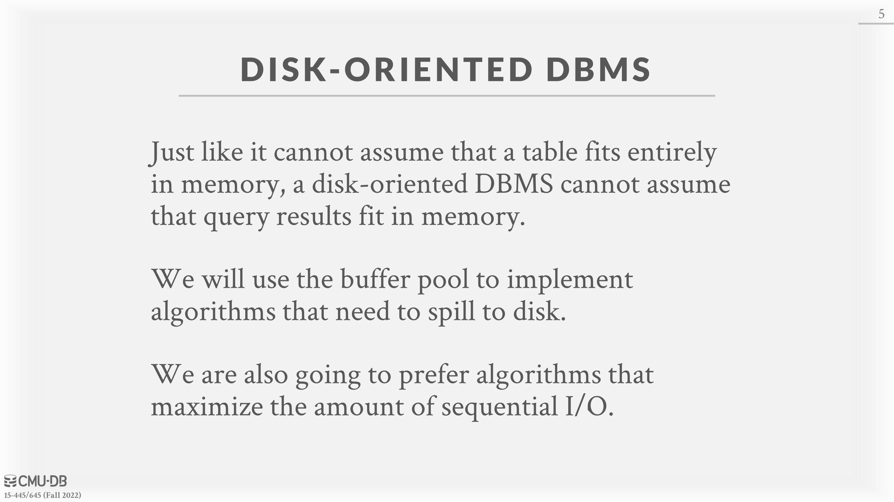
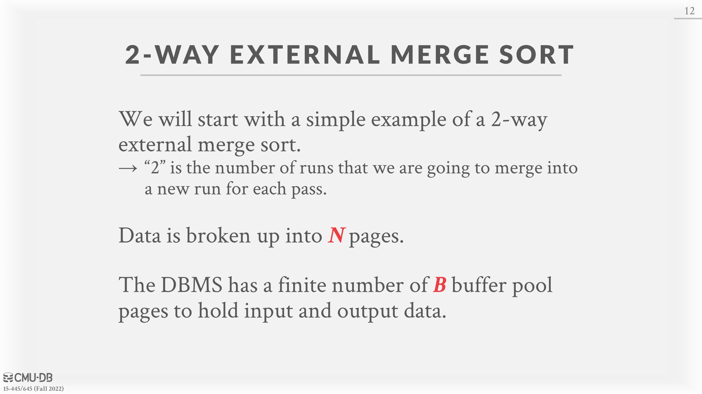
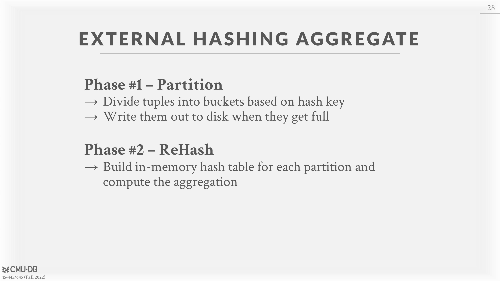
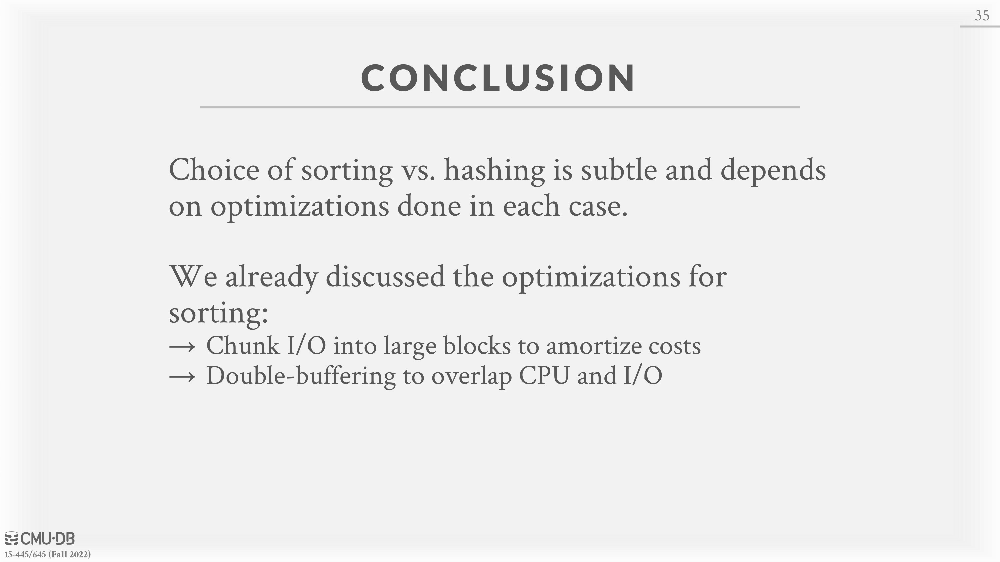

# 10 - Sorting & Aggregation Algorithms

# Sorting

DBMSs need to sort data because tuples in a table have no specific order under the relation model. Sorting is (potentially) used in `ORDER BY`, `GROUP BY`, `JOIN`, and `DISTINCT` operators. If the data that that needs to be sorted fits in memory, then the DBMS can use a standard sorting algorithms (e.g., quicksort). If the data does not fit, then the DBMS needs to use external sorting that is able to spill to disk as needed and prefers sequential over random I/O.

If a query contains an `ORDER BY` with a `LIMIT`, then the DBMS only needs to scan the data once to find the top-N elements. This is called the Top-N Heap Sort. The ideal scenario for heapsort is when the top-N elements fit in memory, so that the DBMS only has to maintain an in-memory sorted priority queue while scanning the data.

The standard algorithm for sorting data which is too large to fit in memory is external merge sort. It is a divide-and-conquer sorting algorithm that splits the data set into separate *runs* and then sorts them individually. It can spill runs to disk as needed then read them back in one at a time. The algorithm is comprised of two phases:
**Phase #1 – Sorting**: First, the algorithm sorts small chunks of data that fit in main memory, and then writes the sorted pages back to disk.
**Phase #2# – Merge: **Then, the algorithm combines the sorted sub-files into a larger single file.

## Two-way Merge Sort

The most basic version of the algorithm is the two-way merge sort. The algorithm reads each page during the sorting phase, sorts it, and writes the sorted version back to disk. Then, in the merge phase, it uses three buffer pages. It reads two sorted pages in from disk, and merges them together into a third buffer page. Whenever the third page fills up, it is written back to disk and replaced with an empty page. Each set of sorted pages is called a run. The algorithm then recursively merges the runs together.
If $N$ is the total number of data pages, the algorithm makes $1 + ⌈ log_2 N ⌉$ total passes through the data (1 for the first sorting step then $⌈ log_2 N ⌉$ for the recursive merging). The total I/O cost is $2N × (\# of \enspace passes)$ since each pass performs an I/O read and an I/O write for each page.

## General (K-way) Merge Sort

The generalized version of the algorithm allows the DBMS to take advantage of using more than three buffer pages. Let $B$ be the total number of buffer pages available. Then, during the sort phase, the algorithm can read B pages at a time and write $\lceil \frac{N}{B} \rceil$ sorted runs back to disk. The merge phase can also combine up to $B − 1$ runs in each pass, again using one buffer page for the combined data and writing back to disk as needed.
In the generalized version, the algorithm performs $1 + log_{B−1}{ \lceil \frac{N}{B} \rceil }$passes (one for the sorting phase and $log_{B−1}{ \lceil \frac{N}{B} \rceil }$ for the merge phase. Then, the total I/O cost is $2N × (\# of \enspace passes)$ since it again has to make a read and write for each page in each pass.

## Double Buffering Optimization

One optimization for external merge sort is prefetching the next run in the background and storing it in a second buffer while the system is processing the current run. This reduces the wait time for I/O requests at each step by continuously utilizing the disk. This optimization requires the use of multiple threads, since the prefetching should occur while the computation for the current run is happening.

## Using B+Trees

It is sometimes advantageous for the DBMS to use an existing B+tree index to aid in sorting rather than using the external merge sort algorithm. In particular, if the index is a clustered index, the DBMS can just traverse the B+tree. Since the index is clustered, the data will be stored in the correct order, so the I/O access will be sequential. This means it is always better than external merge sort since no computation is required. On the other hand, if the index is unclustered, traversing the tree is almost always worse, since each record could be stored in any page, so nearly all record accesses will require a disk read.

# Aggregations

An aggregation operator in a query plan collapses the values of one or more tuples into a single scalar value. There are two approaches for implementing an aggregation: (1) sorting and (2) hashing.

## Sorting

The DBMS first sorts the tuples on the `GROUP BY key(s)`. It can use either an in-memory sorting algorithm if everything fits in the buffer pool (e.g., quicksort) or the external merge sort algorithm if the size of the data exceeds memory. The DBMS then performs a sequential scan over the sorted data to compute the aggregation. The output of the operator will be sorted on the keys.
When performing sorting aggregations, it is important to order the query operations to maximize efficiency. For example, if the query requires a filter, it is better to perform the filter first and then sort the filtered data to reduce the amount of data that needs to be sorted.

## Hashing

Hashing can be computationally cheaper than sorting for computing aggregations. The DBMS populates an ephemeral hash table as it scans the table. For each record, check whether there is already an entry in the hash table and perform the appropriate modification. If the size of the hash table is too large to fit in memory, then the DBMS has to spill it to disk. There are two phases to accomplishing this:
• **Phase #1 – Partition:**  Use a hash function $h_1$ to split tuples into partitions on disk based on target hash key. This will put all tuples that match into the same partition. The DBMS spills partitions to disk via output buffers.
• **Phase #2 – ReHash**: For each partition on disk, read its pages into memory and build an in-memory hash table based on a second hash function $h_2$ (where $h_1 \neq h_2$ ). Then go through each bucket of this hash table to bring together matching tuples to compute the aggregation. This assumes that each partition fits in memory.

During the ReHash phase, the DBMS can store pairs of the form (`GroupByKey`→`RunningValue`) to compute the aggregation. The contents of `RunningValue` depends on the aggregation function. To insert a new tuple into the hash table:
• If it finds a matching `GroupByKey`, then update the `RunningValue` appropriately.
• Else insert a new (`GroupByKey`→`RunningValue`) pair.

