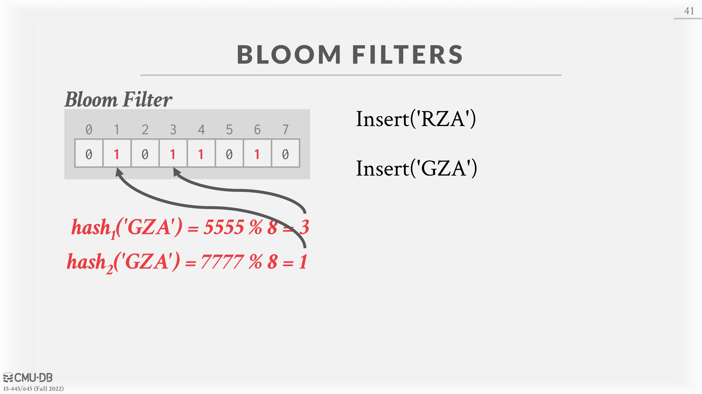
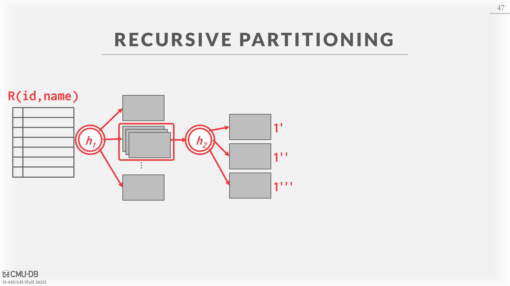

# 11 - Join Algorithms

# Joins

The goal of a good database design is to minimize the amount of information repetition. This is why tables are composed based on normalization theory. Joins are therefore needed to reconstruct the original tables.
This class will cover **inner** **equijoin** algorithms for combining two-tables. An *equijoin* algorithm joins tables where keys are equal. These algorithms can be tweaked to support other joins.

## Operator Output

For a tuple $r ∈ R$ and a tuple $s ∈ S$ that match on join attributes, the join operator concatenates r and s together into a new output tuple.
In reality, contents of output tuples generated by a join operator varies. It depends on the DBMS’s query processing model, storage model, and the query itself. There are multiple approaches to the contents of the join operator output.
• **Data:**  This approach copies the values for the attributes in the outer and inner tables into tuples put into an intermediate result table just for that operator. The advantage of this approach is that future operators in the query plan never need to go back to the base tables to get more data. The disadvantage is that this requires more memory to materialize the entire tuple. This is called ***early materialization***. The DBMS can also do additional computation and omit attributes which will not be needed later in the query to further optimize this approach.
• **Record Ids**: In this approach, the DBMS only copies the join keys along with the record ids of the matching tuples. This approach is ideal for column stores because the DBMS does not copy data that is not needed for the query. This is called_ **late materialization**_.

## Cost Analysis

The cost metric used here to analyze the different join algorithms will be the number of disk I/Os used to compute the join. This includes I/Os incurred by reading data from disk as well as writing any intermediate data out to disk.
Note that only I/Os from computing the join are considered, while I/O incurred when outputting the result is not. This is because the output cost depends on the data, moreover, the output for any join algorithm will be the same and therefore the cost will not change among the different algorithms.

Variables used in this lecture:
• $M$ pages in table $R$ (Outer Table), $m$ tuples total
• $N$ pages in table $S$ (Inner Table), $n$ tuples total

In general, there will be many algorithms/optimizations which can reduce join costs in some cases, but no single algorithm which works well in every scenario.

# Nested Loop Join

At a high-level, this type of join algorithm is comprised of two nested **for** loops that iterate over the tuples in both tables and compares each of them pairwise. If the tuples match the join predicate, then output them. The table in the outer **for** loop is called the *outer table*, while the table in the inner **for** loop is called the *inner table.*

The DBMS will always want to use the “smaller” table as the outer table. Smaller can be in terms of the number of tuples or the number of pages. The DBMS will also want to buffer as much of the outer table in memory as possible. It can also try to leverage an index to find matches in the inner table.

## Simple Nested Loop Join

For each tuple in the outer table, compare it with each tuple in the inner table. This is the worst case scenario where the DBMS must do an entire scan of the inner table for each tuple in the outer table without any caching or access locality.
**Cost**: $M + (m × N)$

## Block Nested Loop Join

For each block in the outer table, fetch each block from the inner table and compare all the tuples in those two blocks. This algorithm performs fewer disk accesses because the DBMS scans the inner table for every outer table block instead of for every tuple.
**Cost**: $M + (M × N)$

If the DBMS has $B$ buffers available to compute the join, then it can use $B − 2$ buffers to scan the outer table. It will use one buffer to scan the inner table and one buffer to store the output of the join.
**Cost**: $M + (\lceil \frac{M}{B−2} \rceil × N)$

## Index Nested Loop Join

The previous nested loop join algorithms perform poorly because the DBMS has to do a sequential scan to check for a match in the inner table. However, if the database already has an index for one of the tables on the join key, it can use that to speed up the comparison. The DBMS can either use an existing index or build a temporary one for the join operation.
The outer table will be the one without an index. The inner table will be the one with the index.
Assume the cost of each index probe is some constant value C per tuple.
**Cost**: $M + (m × C)$

# Sort-Merge Join

At a high-level, a sort-merge join sorts the two tables on their join key(s). The DBMS can use the external mergesort algorithm for this. It then steps through each of the tables with cursors and emits matches (like in mergesort).
This algorithm is useful if one or both tables are already sorted on join attribute(s) (like with a clustered index) **or if the output needs to be sorted on the join key anyways**.
The worst case scenario for this algorithm is if the join attribute for all the tuples in both tables contain the same value, which is very unlikely to happen in real databases. In this case, the cost of merging would be $M · N$. Most of the time though, the keys are mostly unique so the merge cost is approximately $M + N$.

Assume that the DBMS has B buffers to use for the algorithm:

- Sort Cost for Table $R$: $2M × ( 1 + \lceil log_{B−1} \lceil \frac{M}{B} \rceil \rceil)$
- Sort Cost for Table $S$: $2N × ( 1 + \lceil log_{B−1} \lceil \frac{N}{B} \rceil \rceil)$
- Merge Cost: $(M + N)$

**Total Cost: Sort + Merge**

# Hash Join

The high-level idea of the hash join algorithm is to use a hash table to split up the tuples into smaller chunks based on their join attribute(s). This reduces the number of comparisons that the DBMS needs to perform per tuple to compute the join. Hash joins can only be used for equi-joins on the complete join key.

If tuple $r ∈ R$ and a tuple $s ∈ S$ satisfy the join condition, then they have the same value for the join attributes. If that value is hashed to some value $i$, the $R$ tuple has to be in bucket $r_i$ , and the $S$ tuple has to be in bucket $s_i$ . Thus, the $R$ tuples in bucket $r_i$ need only to be compared with the $S$ tuples in bucket $s_i$ .

## Basic Hash Join

• **Phase #1**  **– Build**: First, scan the outer relation and populate a hash table using the hash function $h_1$ on the join attributes. The key in the hash table is the join attributes. The value depends on the implementation (can be full tuple values or a tuple id).
• **Phase #2**  **– Probe**: Scan the inner relation and use the hash function $h_1$ on each tuple’s join attributes to jump to the corresponding location in the hash table and find a matching tuple. Since there may be collisions in the hash table, the DBMS will need to examine the original values of the join attribute(s) to determine whether tuples are truly matching.

If the DBMS knows the size of the outer table, the join can use a static hash table. If it does not know the size, then the join has to use a dynamic hash table or allow for overflow pages.

A table with $N$ pages needs around $\sqrt{N}$ buffers. The above approach creates $B − 1$ spill partitions of size at most $B$ blocks in Phase #1,# so assuming that the hash function distributes records evenly, the largest table that can be hashed with this approach is $B · (B − 1)$ buffers. If the hash function is not uniform, a fudge factor $f > 1$ can be introduced, therefore the largest such table is $B · \sqrt{f · N}$.(注意这里的Hash表的每个blocks都放在disk中的)

One optimization for the probe phase is the usage of a [Bloom Filter](https://en.wikipedia.org/wiki/Bloom_filter). This is a probabilistic data structure that can fit in CPU caches and answer the question is key $x$ in the hash table? with either definitely no or **probably** yes. This can reduce the amount of disk I/O by preventing disk reads that do not result in an emitted tuple.

## Grace Hash Join / Partitioned Hash Join

When the tables do not fit on main memory, the DBMS has to swap tables in and out essentially at random, which leads to poor performance. The Grace Hash Join is an extension of the basic hash join that also hashes the inner table into partitions that are written out to disk.

•** Phase #1# – Build**: First, scan both the outer and inner tables and populate a hash table using the hash function $h_1$ on the join attributes. The hash table’s buckets are written out to disk as needed. If a single bucket does not fit in memory, the DBMS can use *recursive partitioning* with different hash function $h_2$ (where $h_1 \neq h_2$ ) to **further divide the bucket**. This can continue recursively until the buckets fit  into memory.
• **Phase #2 – Probe:**  For each bucket level, retrieve the corresponding pages for both outer and inner tables. Then, perform a nested loop join on the tuples in those two pages. The pages will fit in memory, so this join operation will be fast.
Partitioning Phase Cost: $2 × (M + N)$
Probe Phase Cost: $(M + N)$
Total Cost: $3 × (M + N)$

Hybrid hash join optimization: adapts between basic hash join and Grace hash join; if the keys are skewed, keep the hot partition in-memory and immediately perform the comparison instead of spilling it to disk. Difficult to implement correctly.

# Conclusion

Joins are an essential part of interacting with relational databases, and it is therefore critical to ensure that a DBMSs has efficient algorithms to execute joins.

The table above assume the following: $M=1000$, $m= 500$, $n =100000$, $N=500$, $n= 40000$, $B = 100$ and 0.1 ms per I/O. Sort cost is $R + S = 4000 + 2000$ IOs, where $R = 2 · M · ( 1 + ⌈ log_{B−1} ⌈ M/B ⌉⌉ ) = 2000 · (1 + ⌈ log_{99} ⌈ 1000/100 ⌉ ) = 4000$ and $S = 2 · N · ( 1 + ⌈ log_{B−1} ⌈ N/B ⌉⌉ ) = 1000 · (1 + ⌈ log_{99} ⌈ 500/100 ⌉ ) = 2000$.

Hash joins are almost always better than sort-based join algorithms, but there are cases in which sortingbased joins would be preferred. This includes queries on non-uniform data, when the data is already sorted on the join key, and when the result needs to be sorted. Good DBMSs will use either, or both.

