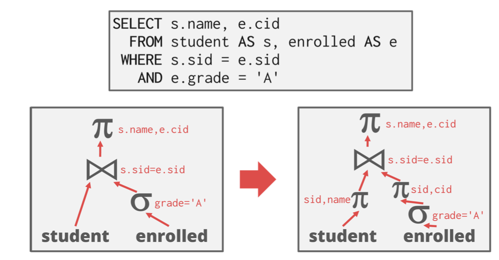
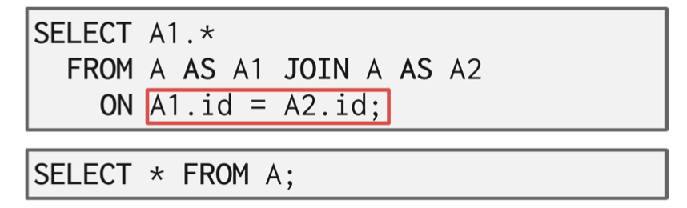
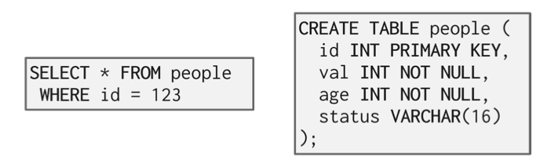
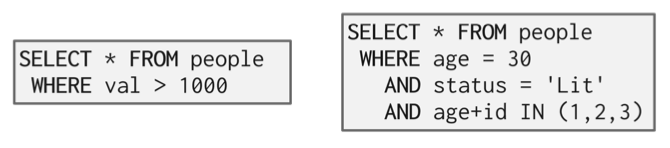
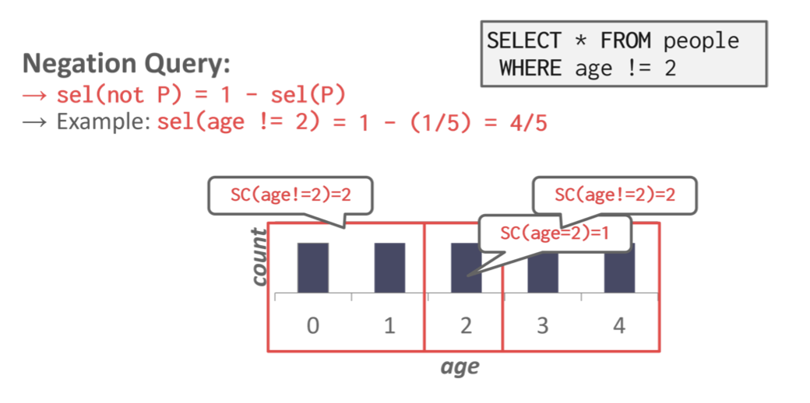

# 14 - Query Planning & Optimization

# Overview

Because SQL is declarative, the query only tells the DBMS what to compute, but not how to compute it. Thus, the DBMS needs to translate a SQL statement into an executable query plan. But there are different ways to execute each operator in a query plan (e.g., join algorithms) and there will be differences in performance among these plans. The job of the DBMS’s optimizer is to pick an optimal plan for any given query.

![5.jpg](https://cdn.nlark.com/yuque/0/2023/jpeg/22382307/1681183439919-a7c58d6e-9268-4e44-b0ae-c936cea9c8b4.jpeg#averageHue=%23dedede&clientId=u2c114338-f416-4&from=ui&id=u32f82735&name=5.jpg&originHeight=1688&originWidth=3000&originalType=binary&ratio=2&rotation=0&showTitle=true&size=394800&status=done&style=none&taskId=u502960f2-bdca-4be6-bbd9-84f2f857c1b&title=Figure%201%3A%20Architecture%20Overview%20%E2%80%93%20The%20application%20connected%20to%20the%20database%20system%20and%20sends%20a%20SQL%20query%2C%20which%20may%20be%20rewritten%20to%20a%20different%20format.%20The%20SQL%20string%20is%20parsed%20into%20tokens%20that%20make%20up%20the%20syntax%20tree.%20The%20binder%20converts%20named%20objects%20in%20the%20syntax%20tree%20to%20internal%20identi%EF%AC%81ers%20by%20consulting%20the%20system%20catalog.%20The%20binder%20emits%20a%20logical%20plan%20which%20may%20be%20fed%20to%20a%20tree%20rewriter%20for%20additional%20schema%20info.%20The%20logical%20plan%20is%20given%20to%20the%20optimizer%20which%20selects%20the%20most%20ef%EF%AC%81cient%20procedure%20to%20execute%20the%20plan.)
**Figure 1: Architecture Overview** – The application connected to the database system and sends a SQL query, which may be rewritten to a different format. The SQL string is parsed into tokens that make up the syntax tree. The binder converts named objects in the syntax tree to internal identifiers by consulting the system catalog. The binder emits a logical plan which may be fed to a tree rewriter for additional schema info. The logical plan is given to the optimizer which selects the most efficient procedure to execute the plan.

The first implementation of a query optimizer was IBM System R and was designed in the 1970s. Prior to this, people did not believe that a DBMS could ever construct a query plan better than a human. Many concepts and design decisions from the System R optimizer are still in use today.
There are two high-level strategies for query optimization.
The first approach is to use static rules, or ***heuristics***. Heuristics match portions of the query with known patterns to assemble a plan. These rules transform the query to remove inefficiencies. Although these rules may **require consultation of the catalog to understand the structure of the data, they never need to examine the data itself.** 
An alternative approach is to use ***cost-based search*** to read the data and estimate the cost of executing equivalent plans. The cost model chooses the plan with the lowest cost.
Query optimization is the most difficult part of building a DBMS. Some systems have attempted to apply **machine learning** to improve the accuracy and efficiency of optimizers, but no major DBMS currently deploys an optimizer based on this technique.

## Logical vs. Physical Plans

The optimizer generates a mapping of a ***logical algebra expression*** to the optimal equivalent physical algebra expression. The logical plan is roughly equivalent to the relational algebra expressions in the query.

**Physical operators**  define a specific execution strategy **using an access path** for the different operators in the query plan. Physical plans may depend on the physical format of the data that is processed (i.e. sorting, compression).

There does not always exist a one-to-one mapping from logical to physical plans.

# Logical Query Optimization

Some selection optimizations include:

- Perform filters as early as possible (predicate pushdown).
- **Reorder predicates** so that the DBMS applies the most selective one first.
- Breakup a complex predicate and pushing it down (split conjunctive predicates).

An example of predicate pushdown is shown in ??.

Some projection optimizations include:

- Perform projections as early as possible to create smaller tuples and reduce intermediate results (*projection pushdown*).
- Project out all attributes except the ones requested or requires.

An example of projection pushdown in shown in Figure 2.

**Figure 2: Projection Pushdown** – Since the query only asks for the student name and ID, the DBMS can remove all columns except for those two before applying the join.

The DBMS can also optimize nested sub-queries without referencing a cost model. There are two different approaches to this type of optimization:

• Re-write the query by de-correlating and / or flattening it. An example of this is shown in Figure 6.

• Decompose the nested query and store the result to a temporary table. An example of this is shown in Figure 7.

**Figure 6: Subquery Optimization** - Rewriting The former query can be rewritten as the latter query by rewriting the subquery as a `JOIN`. Removing a level of nesting in this way effectively *flattens* the query.

**Figure 7: Subquery Optimization - Decomposition** – For complex queries with subqueries, the DBMS optimizer may break up the original query into blocks and focus on optimizing each individual block at a a time. In this example, the optimizer decomposes a query with a nested aggregation by pulling the nested query out into its own query, and subsequently using this result to realize the logic of the original query.

Another optimization that a DBMS can use is to remove impossible or *unnecessary predicates*. In this optimization, the DBMS elides evaluation of predicates whose result does not change per tuple in a table. Bypassing these predicates reduces computation cost. Figure 3 shows two examples of *unnecessary predicates*.

**Figure 3: Unnecessary Predicates** – The predicate in the first query will always be false and can be disregarded. The former query can be rewritten as the latter query to produce the same result but save on computation.

A similar optimization is merging predicates. An example of this optimization is shown in Figure 4.

**Figure 4: Merging Predicates** – The WHERE predicate in query 1 has redundancy as what it is searching for is any value between 1 and 150. Query 2 shows the more succinct way to express request in query 1.

The ordering of `JOIN` operations is a key determinant of query performance. Exhaustive enumeration of all possible join orders is inefficient, so join-ordering optimization requires a cost model. However, we can still eliminate *unnecessary joins* with a heuristic approach to optimization. An example of join elimination is shown in Figure 5.

**Figure 5: Join Elimination** – The join in query 1 is wasteful because every tuple in A must exist in A. Query 1 can instead be written as query 2.

# Cost Estimations

DBMS’s use cost models to estimate the cost of executing a plan. These models evaluate equivalent plans for a query to help the DBMS select the most optimal one.

The cost of a query depends on several underlying metrics, including:

• **CPU**: small cost, but tough to estimate.

• **Disk I/O**: the number of block transfers.

• **Memory**: the amount of DRAM used.

Exhaustive enumeration of all valid plans for a query is much too slow for an optimizer to perform. For joins alone, which are commutative and associative, there are $4^n$ different orderings of every n-way join. Optimizers must limit their search space in order to work efficiently.

To approximate costs of queries, DBMS’s maintain internal *statistics* about tables, attributes, and indexes in their internal catalogs. Different systems maintain these statistics in different ways. Most systems attempt to avoid on-the-fly computation by maintaining an internal table of statistics. These internal tables may then be updated in the background.

For each relation $R$, the DBMS maintains the following information:

- $N_R$: Number of tuples in R
- $V (A, R)$: Number of distinct values of attribute A

With the information listed above, the optimizer can derive the selection *cardinality* $SC(A, R)$ statistic. The selection cardinality is the average number of records with a value for an attribute $A$ given $\frac{N_R}{V (A,R)}$ . Note that this assumes data uniformity. This assumption is often incorrect, but it simplifies the optimization process.

## Selection Statistics

The **selection cardinality** can be used to determine the number of tuples that will be selected for a given input.

Equality predicates on unique keys are simple to estimate (see Figure 8). A more complex predicate is shown in Figure 9.

**Figure 8: Simple Predicate Example** – In this example, determining what index to use is easy because the query contains an equality predicate on a unique key.

**Figure 9: Complex Predicate Example** – More complex predicates, such as range or conjunctions, are harder to estimate because the selection cardinalities of the predicates must be combined in non-trivial ways.

The *selectivity* (sel) of a predicate P is the fraction of tuples that qualify. The formula used to compute selective depends on the type of predicate. Selectivity for complex predicates is hard to estimate accurately which can pose a problem for certain systems. An example of a selectivity computation is shown in Figure 10.

**Figure 10: Selectivity of Negation Query Example** – The selectivity of the negation query is computed by subtracting the selectivity of the positive query from 1. In the example, the answer comes out to be $\frac{4}{5}$ which is accurate.

Observe that the **selectivity** of a predicate is equivalent to the probability of that predicate. This allows probability rules to be applied in many selectivity computations. This is particularly useful when dealing with complex predicates. For example, if we assume that multiple predicates involved in a conjunction are *independent*, we can compute the total selectivity of the conjunction as the product of the selectivities of the individual predicates.

## Selectivity Computation Assumptions

In computing the selection cardinality of predicates, the following three assumptions are used.

- **Uniform Data**: The distribution of values (except for the heavy hitters) is the same.
- **Independent Predicates**: The predicates on attributes are independent.
- **Inclusion Principle:**  The domain of join keys overlap such that each key in the inner relation will also exist in the outer table.

These assumptions are often not satisfied by real data. For example, *correlated attributes* break the assumption of independence of predicates.

# Histograms

Real data is often skewed and is tricky to make assumptions about. However, storing every single value of a data set is expensive. One way to reduce the amount of memory used by storing data in a *histogram* to group together values. An example of a graph with buckets is shown in Figure 11.

**Figure 11: Equi-Width Histogram**: The first figure shows the original frequency count of the entire data set. The second figure is an equi-width histogram that combines together the counts for adjacent keys to reduce the storage overhead.

Another approach is to use a equi-depth histogram that varies the width of buckets so that the **total number of occurrences for each bucket is roughly the same**. An example is shown in Figure 12.

**Figure 12: Equi-Depth Histogram** – To ensure that each bucket has roughly the same number of counts, the histogram varies the range of each bucket.

In place of histograms, some systems may use *sketches* to generate approximate statistics about a data set.

# Sampling

DBMS’s can use *sampling* to apply predicates to a smaller copy of the table with a similar distribution (see Figure 13). The DBMS updates the sample whenever the amount of changes to the underlying table exceeds some threshold (e.g., 10% of the tuples).

**Figure 13: Sampling** – Instead of using one billion values in the table to estimate selectivity, the DBMS can derive the selectivities for predicates from a subset of the original table.

# Single-Relation Query Plans

For single-relation query plans, the biggest obstacle is choosing the best access method (i.e., sequential scan, binary search, index scan, etc.) Most new database systems just use heuristics, instead of a sophisticated cost model, to pick an access method.

For OLTP queries, this is especially easy because they are sargable (Search Argument Able), which means that there exists a best index that can be selected for the query. This can also be implemented with simple heuristics.

# Multi-Relation Query Plans

For Multi-Relation query plans, as number of joins increases, the number of alternative plans grow rapidly. Consequently, it is important to restrict the search space so as to be able to find the optimal plan in a reasonable amount of time. There are two ways to approach this search problem:

- **Bottom-up**: Start with nothing and then build up the plan to get to the outcome that you want.
  Examples: IBM System R, DB2, MySQL, Postgres, most open-source DBMSs.
- **Top-down**: Start with the outcome that you want, and then work down the tree to find the optimal plan that gets you to that goal. Examples: MSSQL, Greenplum, CockroachDB, Volcano

## Bottom-up optimization example - System R

Use static rules to perform initial optimization. Then use dynamic programming to determine the best join order for tables using a divide-and conquer search method.

- Break query up into blocks and generate the logical operators for each block.
- For each logical operator, generate a set of physical operators that implement it.
- Then, iteratively construct a ”left-deep” tree that minimizes the estimated amount of work to execute the plan

## Top-down optimization example - Volcano

Start with a logical plan of what we want the query to be. Perform a branch-and-bound search to traverse the plan tree by converting logical operators into physical operators.

- Keep track of global best plan during search.
- Treat physical properties of data as first-class entities during planning.

