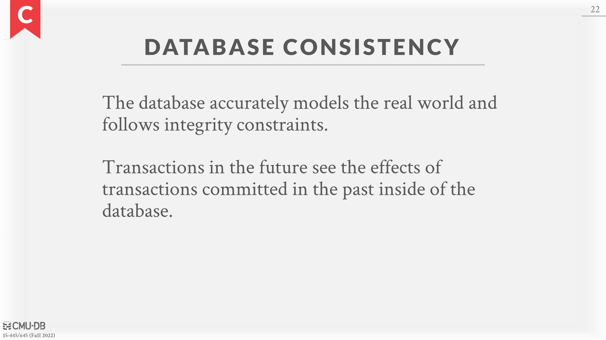
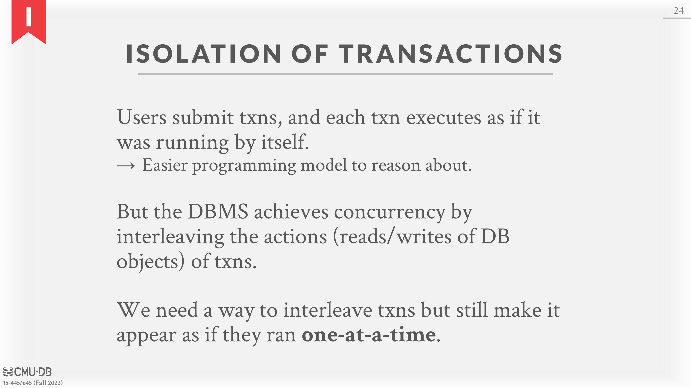
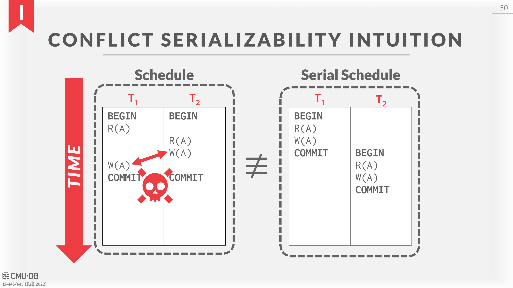

# 15 - Concurrency Control Theory

# Motivation

- **Lost Update Problem** (**Concurrency Control**): How can we avoid race conditions when updating records at the same time?
- **Durability Problem** (**Recovery**): How can we ensure the correct state in case of a power failure?

# Transactions

A *transaction* is the execution of a sequence of one or more operations (e.g., SQL queries) on a shared database to perform some higher level function. They are the basic unit of change in a DBMS. Partial transactions are not allowed (i.e. transactions must be atomic).

Example: Move $100 from Andy’s bank account to his promotor’s account

1. Check whether Andy has $100.
2. Deduct $100 from his account.
3. Add $100 to his promotor’s account.

Either all of the steps need to be completed or none of them should be completed.

## The Strawman System

A simple system for handling transactions is to execute one transaction at a time **using a single worker** (e.g. one thread). Thus, only one transaction can be running at a time. To execute the transaction, the DBMS copies the entire database file and makes the transaction changes to this new file. If the transaction succeeds, then the new file becomes the current database file. If the transaction fails, the DBMS discards the new file and none of the transaction’s changes have been saved. This method is slow as it does not allow for concurrent transactions and requires copying the whole database file for every transaction.

A (potentially) better approach is to allow concurrent execution of independent transactions while also maintaining correctness and fairness (as in all transactions are treated with equal priority and don’t get ”starved” by never being executed). But executing concurrent transactions in a DBMS is challenging. It is difficult to ensure correctness (for example, if Andy only has $100 and tries to pay off two promoters at once, who should get paid?) while also executing transactions quickly (our strawman example guarantees sequential correctness, but at the cost of parallelism).

Arbitrary interleaving of operations can lead to:

- **Temporary Inconsistency:**  Unavoidable, but not an issue.
- **Permanent Inconsistency**: Unacceptable, cause problems with correctness and integrity of data.

The scope of a transaction is only inside the database. It cannot make changes to the outside world because it cannot roll those back. For example, if a transaction causes an email to be sent, this cannot be rolled back by the DBMS if the transaction is aborted.

# Definitions

Formally, a *database* can be represented as a fixed set of named data objects $(A, B, C, . . .)$. These objects can be attributes, tuples, pages, tables, or even databases. The algorithms that we will discuss work on any type of object but all objects must be of the same type.

A transaction is a sequence of read and write operations (i.e., $R(A)$, $W(B)$) on those objects. To simplify discussion, this definition assumes the database is a fixed size, so the operations can only be reads and updates, not inserts or deletions.

The boundaries of transactions are defined by the client. In SQL, a transaction starts with the `BEGIN` command. The outcome of a transaction is either `COMMIT` or `ABORT`. For `COMMIT`, either all of the transaction’s modifications are saved to the database, or the DBMS overrides this and aborts instead.

For `ABORT`, all of the transaction’s changes are undone so that it is like the transaction never happened. Aborts can be either self-inflicted or caused by the DBMS.

The criteria used to ensure the correctness of a database is given by the acronym **ACID**.

- **A**tomicity: Atomicity ensures that either all actions in the transaction happen, or none happen.
- **C**onsistency: If each transaction is consistent and the database is consistent at the beginning of the transaction, then the database is guaranteed to be consistent when the transaction completes.
- **I**solation: Isolation means that when a transaction executes, it should have the illusion that it is isolated from other transactions.
- **D**urability: If a transaction commits, then its effects on the database should persist.

# ACID: Atomicity

The DBMS guarantees that transactions are **atomic**. The transaction either executes all its actions or none of them. There are two approaches to this:

## Approach #1:# Logging

DBMS logs all actions so that it can undo the actions of aborted transactions. It maintains undo records both in memory and on disk. Logging is used by almost all modern systems for audit and efficiency reasons.

## Approach #2:# Shadow Paging

The DBMS makes copies of pages modified by the transactions and transactions make changes to those copies. Only when the transaction commits is the page made visible. This approach is typically slower at runtime than a logging-based DBMS. However, one benefit is, if you are only single threaded, there is no need for logging, so there are less writes to disk when transactions modify the database. This also makes recovery simple, as all you need to do is delete all pages from uncommitted transactions. In general, though, better runtime performance is preferred over better recovery performance, so this is rarely used in practice.

# ACID: Consistency

At a high level, consisitency means the “world” represented by the database is **logically** correct. All questions (i.e., queries) that the application asks about the data will return logically correct results. There are two notions of consistency:

**Database Consistency**: The database accurately represents the real world entity it is modeling and follows integrity constraints. (E.g. The age of a person cannot not be negative). Additionally, transactions in the future should see the effects of transactions committed in the past inside of the database.

**Transaction Consistency**: If the database is consistent before the transaction starts, it will also be consistent after. Ensuring transaction consistency is the **application’s** responsibility.

# ACID: Isolation

The DBMS provides transactions the illusion that they are running alone in the system. They do not see the effects of concurrent transactions. This is equivalent to a system where transactions are executed in serial order (i.e., one at a time). But to achieve better performance, the DBMS has to interleave the operations of concurrent transactions while maintaining the illusion of isolation.

## Concurrency Control

A *concurrency control protocol* is how the DBMS decides the proper interleaving of operations from multiple transactions at runtime.

There are two categories of concurrency control protocols:

1. **Pessimistic**: The DBMS assumes that transactions will conflict, so it doesn’t let problems arise in the first place.
2. **Optimistic**: The DBMS assumes that conflicts between transactions are rare, so it chooses to deal with conflicts when they happen after the transactions commit.

The order in which the DBMS executes operations is called an *execution schedule*. We want to interleave transactions to maximize concurrency while ensuring that the output is “correct”. The goal of a concurrency control protocol is to generate an execution schedule that is is **equivalent to some serial execution**:

- **Serial Schedule**: Schedule that does not interleave the actions of different transactions.
- **Equivalent Schedules**: For any database state, if the effect of execution the first schedule is identical to the effect of executing the second schedule, the two schedules are equivalent.
- **Serializable Schedule**: A serializable schedule is a schedule that is equivalent to any serial execution of the transactions. Different serial executions can produce different results, but all are considered “correct”.

A *conflict* between two operations occurs if the operations are for different transactions, they are performed on the same object, and at least one of the operations is a write. There are three variations of conflicts:

- **Write-Read Conflicts** (“**Dirty Reads**”): A transaction sees the write effects of a different transaction before that transaction committed its changes.
- **Read-Write Conflicts** (“**Unrepeatable Reads**”): A transaction is not able to get the same value when reading the same object multiple times.
- **Write-Write conflict** (“**Lost Updates**”): One transaction overwrites the uncommitted data of another concurrent transaction.

There are two types for serializability: (1) *conflict* and (2) *view*. Neither definition allows all schedules that one would consider serializable. In practice, DBMSs support conflict serializability because it can be enforced efficiently.

## Conflict Serializability

Two schedules are ***conflict equivalent*** iff they involve the same operations of the same transactions and every pair of conflicting operations is ordered in the same way in both schedules. A schedule $S$ is ***conflict serializable*** if it is conflict equivalent to some **serial schedule**.

One can verify that a schedule is conflict serializable by swapping non-conflicting operations until a serial schedule is formed. For schedules with many transactions, this becomes too expensive. A better way to verify schedules is to use a *dependency graph* (*precedence graph*).

In a dependency graph, each transaction is a node in the graph. There exists a directed edge from node $T_i$  to $T_j$ iff an operation $O_i$ from $T_i$ conflicts with an operation $O_j$ from $T_j$ and $O_i$ occurs before $O_j$ in the schedule. Then, a schedule is conflict serializable iff the dependency graph is acyclic.

## View Serializability

*View serializability* is a weaker notion of serializibility that allows for all schedules that are conflict serializable and “**blind writes**” (i.e. performing writes without reading the value first). Thus, it allows for more schedules than conflict serializability, but is difficult to enforce efficiently. This is because the DBMS does not know how the application will “interpret” values.

## Universe of Schedules

$SerialSchedules ⊂ ConflictSerializableSchedules ⊂ V iewSerializableSchedules ⊂ AllSchedules$

# ACID: Durability

All of the changes of committed transactions must be **durable** (i.e., persistent) after a crash or restart. The DBMS can either use logging or shadow paging to ensure that all changes are durable.

