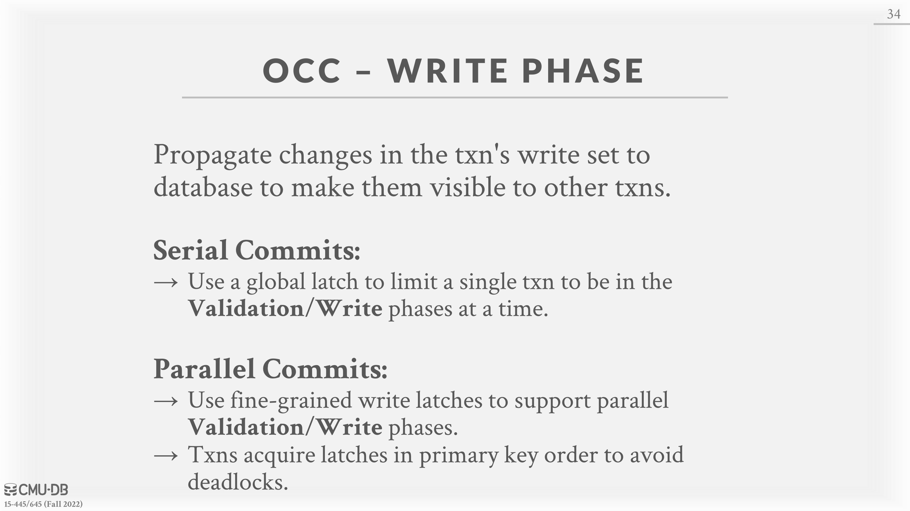
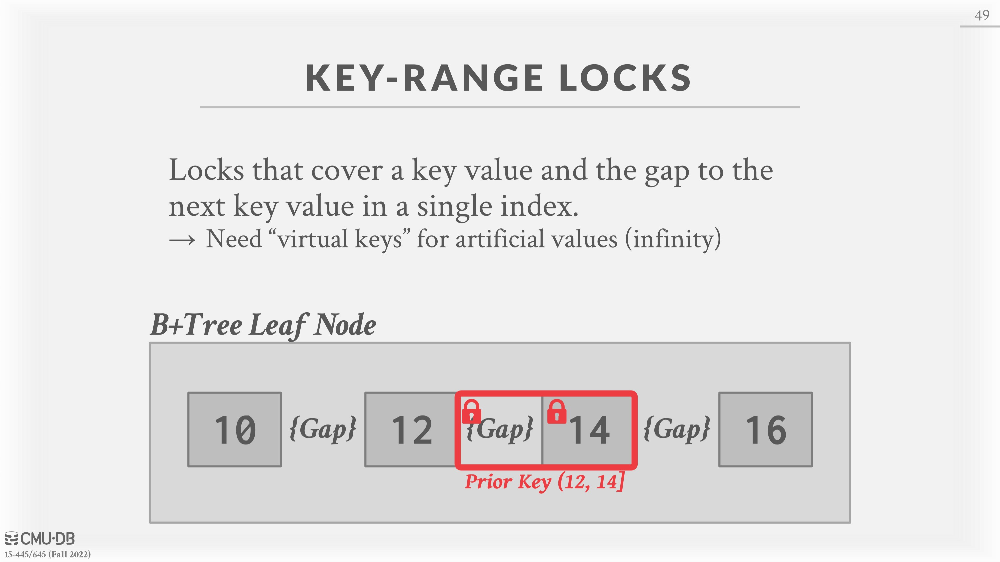

# 17 - Timestamp-Ordering Concurrency Control

# Timestamp Ordering Concurrency Control

Timestamp ordering (T/O) is an **optimistic** class of concurrency control protocols where the DBMS assumes that transaction conflicts are rare. Instead of requiring transactions to acquire locks before they are allowed to read/write to a database object, the DBMS instead uses timestamps to determine the serializability order of transactions.

Each transaction $T_i$ is assigned a unique fixed timestamp $TS(T_i )$ that is monotonically increasing. Different schemes assign timestamps at different times during the transaction. Some advanced schemes even assign multiple timestamps per transaction.

If $TS(T_i ) &lt; TS(T_j )$, then the DBMS must ensure that the execution schedule is equivalent to the serial schedule where $T_i$ appears before $T_j$.

There are multiple timestamp allocation implementation strategies. The DBMS can use the system clock as a timestamp, but issues arise with edge cases like daylight savings. Another option is to use a logical counter. However, this has issues with overflow and with maintaining the counter across a distributed system with multiple machines. There are also hybrid approaches that use a combination of both methods.

# Basic Timestamp Ordering (BASIC T/O)

The basic timestamp ordering protocol (BASIC T/O) allows reads and writes on database objects without using locks. Instead, every database object X is tagged with timestamp of the last transaction that successfully performed a read (denoted as $R-TS(X)$) or write (denoted as $W-TS(X)$) on that object. The DBMS then checks these timestamps for every operation. If a transaction tries to access an object in a way which violates the timestamp ordering, the transaction is aborted and restarted. The underlying assumption is that violations will be rare and thus these restarts will also be rare.

## Read Operations

For read operations, if $TS(T_i ) &lt; W-TS(X)$, this violates timestamp order of $T_i$ with regard to the previous writer of $X$ (do not want to read something that is written in the “future”). Thus, $T_i$ is aborted and restarted with a new timestamp. Otherwise, the read is valid and $T_i$ is allowed to read $X$. The DBMS then updates $R-TS(X)$ to be the max of $R-TS(X)$ and $TS(T_i )$. It also has to make a local copy of $X$ in a private workspace to ensure repeatable reads for $T_i$ .

## Write Operations

For write operations, if $TS(T_i ) &lt; R-TS(X)$ or $TS(T_i ) &lt; W-TS(X)$, $T_i$ must be restarted (do not want to overwrite “future” change). Otherwise, the DBMS allows $T_i$ to write $X$ and updates $W-TS(X)$. Again, it needs to make a local copy of $X$ to ensure repeatable reads for $T_i$ .

## Optimization: Thomas Write Rule

An optimization for writes is if $TS(T_i ) &lt; W-TS(X)$, the DBMS can instead ignore the write and allow the transaction to continue instead of aborting and restarting it. This is called the **Thomas Write Rule.**  Note that this violates timestamp order of $T_i$ but this is okay because no other transaction will ever read $T_i$ ’s write to object $X$.

The Basic T/O protocol generates a schedule that is conflict serializable if it does not use Thomas Write Rule. It cannot have deadlocks because no transaction ever waits. However, there is a possibility of starvation for long transactions if short transactions keep causing conflicts.

It also permits schedules that are not recoverable. A schedule is *recoverable* if transactions commit only after all transactions whose changes they read, commit. Otherwise, the DBMS cannot guarantee that transactions read data that will be restored after recovering from a crash.

## **Potential Issues:**

• High overhead from copying data to transaction’s workspace and from updating timestamps.

• Long running transactions can get starved. The likelihood that a transaction will read something from a newer transaction increases.

• Suffers from the timestamp allocation bottleneck on highly concurrent systems.

# Optimistic Concurrency Control (OCC)

Optimistic concurrency control (OCC) is another optimistic concurrency control protocol which also uses timestamps to validate transactions. OCC works best when the number of conflicts is low. This is when either all of the transactions are read-only or when transactions access disjoint subsets of data. If the database is large and the workload is not skewed, then there is a low probability of conflict, making OCC a good choice.

In OCC, the DBMS creates a *private workspace* for each transaction. All modifications of the transaction are applied to this workspace. Any object read is copied into workspace and any object written is copied to the workspace and modified there. No other transaction can read the changes made by another transaction in its private workspace.

When a transaction commits, the DBMS compares the transaction’s workspace write set to see whether it conflicts with other transactions. If there are no conflicts, the write set is installed into the “global” database.

OCC consists of three phases:

1. **Read Phase**: Here, the DBMS tracks the read/write sets of transactions and stores their writes in a private workspace.
2. **Validation Phase:**  When a transaction commits, the DBMS checks whether it conflicts with other transactions.
3. **Write Phase:**  If validation succeeds, the DBMS applies the private workspace changes to the database.

**Otherwise, it aborts and restarts the transaction.**

## Validation Phase

The DBMS assigns transactions timestamps when they enter the validation phase. To ensure only serializable schedules are permitted, the DBMS checks $T_i$ against other transactions for RW and WW conflicts and makes sure that all conflicts go one way.

• **Approach 1**: Backward validation (from younger transactions to older transactions)

• **Approach 2**: Forward validation (from older transactions to younger transactions)

Here we describes how forward validation works. The DBMS checks the timestamp ordering of the committing transaction with all other running transactions. Transactions that have not yet entered the validation phase are assigned a timestamp of ∞.

If $TS(T_i ) &lt; TS(T_j )$, then one of the following three conditions must hold:

1. $T_i$ completes all three phases before $T_j$ begins its execution (serial ordering).
2. $T_i$ completes before $T_j$ starts its Write phase, and $T_i$ does not write to any object read by $T_j$ . $WriteSet(T_i ) ∩ ReadSet(T_j ) = ∅$.
3. $T_i$ completes its Read phase before $T_j$ completes its Read phase, and $T_i$ does not write to any object that is either read or written by $T_j$ . $WriteSet(T_i ) ∩ ReadSet(T_j ) = ∅$, and $WriteSet(T_i ) ∩ WriteSet(T_j ) = ∅$.

## Potential Issues:

• High overhead for copying data locally into the transaction’s private workspace.

• Validation/Write phase bottlenecks.

• Aborts are potentially more wasteful than in other protocols because they only occur after a transaction has already executed.

• Suffers from timestamp allocation bottleneck.

# Dynamic Databases

# Isolation Levels

Serializability is useful because it allows programmers to ignore concurrency issues but enforcing it may allow too little parallelism and limit performance. We may want to use a weaker level of consistency to improve scalability.

Isolation levels control the extent that a transaction is exposed to the actions of other concurrent transactions.

**Anomalies:** 
• **Dirty Read**: Reading uncommitted data.
• **Unrepeatable Reads:**  Redoing a read results in a different result.
• **Phantom Reads**: Insertion or deletions result in different results for the same range scan queries.

**Isolation Levels (Strongest to Weakest):**

1. SERIALIZABLE: No Phantoms, all reads repeatable, and no dirty reads.

2. REPEATABLE READS: Phantoms may happen.

3. READ-COMMITTED: Phantoms and unrepeatable reads may happen.

4. READ-UNCOMMITTED: All anomalies may happen.

The isolation levels defined as part of SQL-92 standard only focused on anomalies that can occur in a 2PL-based DBMS. There are two additional isolation levels:

1. CURSOR STABILITY

   • Between repeatable reads and read committed

   • Prevents **Lost Update** Anomaly.

   • Default isolation level in **IBM DB2**.
2. **SNAPSHOT ISOLATION**

   • Guarantees that all reads made in a transaction see a consistent snapshot of the database that existed at the time the transaction started.

   • A transaction will commit only if its writes do not conflict with any concurrent updates made since that snapshot.

   • Susceptible to **write skew** anomaly.

