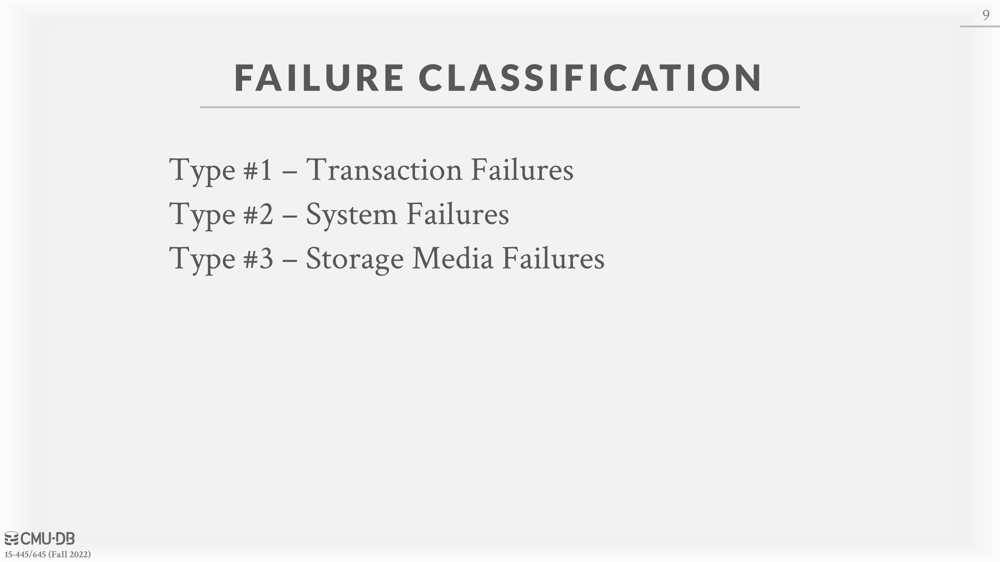
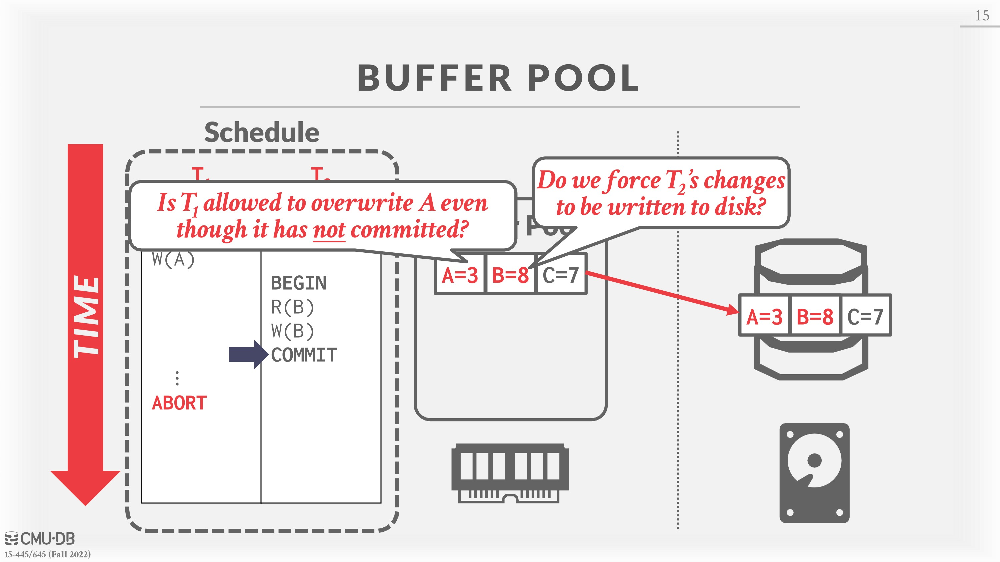
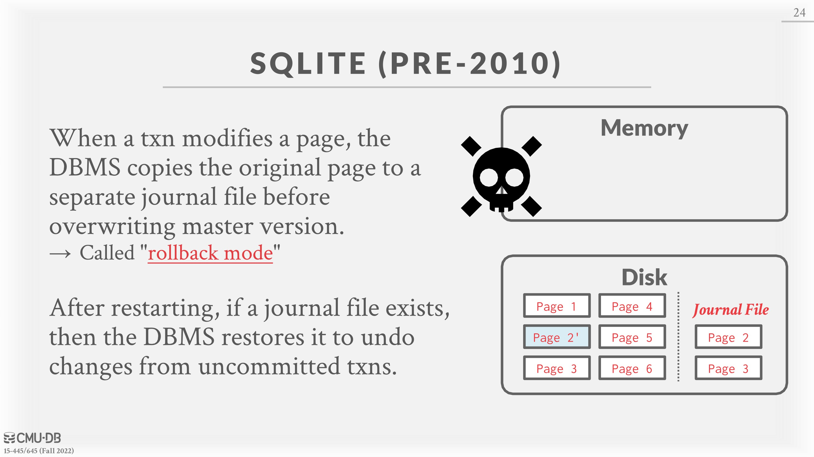
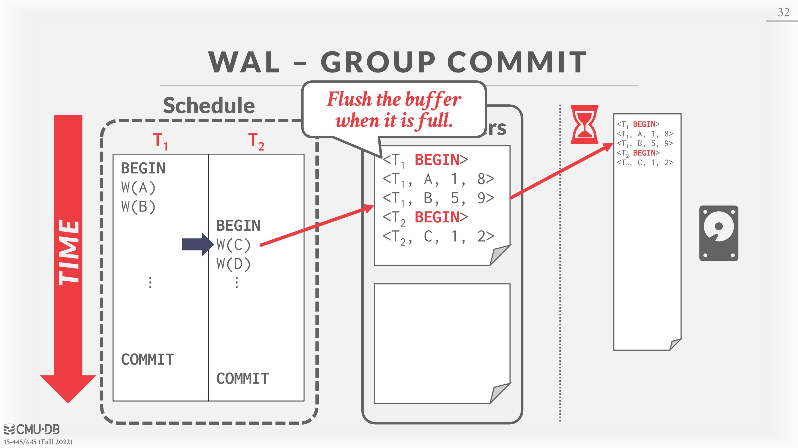
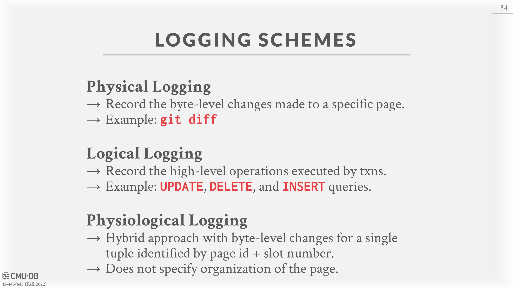

# 19 - Database Logging & Shadow Paging

# Crash Recovery

*Recovery algorithms* are techniques to ensure database consistency, transaction atomicity, and durability despite failures. When a crash occurs, all the data in memory that has not been committed to disk is at risk of being lost. Recovery algorithms act to prevent loss of information after a crash.

Every recovery algorithm has two parts:

• Actions during normal transaction processing to ensure that the DBMS can recover from a failure.

• Actions after a failure to recover the database to a state that ensures atomicity, consistency, and durability.

The key primitives that used in recovery algorithms are UNDO and REDO. Not all algorithms use both primitives.

• **UNDO**: The process of removing the effects of an incomplete or aborted transaction.

• **REDO**: The process of re-applying the effects of a committed transaction for durability.

# Storage Types

• **Volatile Storage**

– Data does not persist after power is lost or program exits.

– Examples: DRAM, SRAM,.

• **Non-Volatile Storage**

– Data persists after losing power or program exists.

– Examples: HDD, SDD.

• **Stable Storage**

– A non-existent form of non-volatile storage that survives all possible failures scenarios.

– Use multiple storage devices to approximate.

# Failure Classification

Because the DBMS is divided into different components based on the underlying storage device, there are a number of different types of failures that the DBMS needs to handle. Some of these failures are recoverable while others are not.

## Type #1:# Transaction Failures

*Transactions failures* occur when a transaction reaches an error and must be aborted. Two types of errors that can cause transaction failures are logical errors and internal state errors.

• **Logical Errors**: A transaction cannot complete due to some internal error condition (e.g., integrity, constraint violation).

• **Internal State Errors**: The DBMS must terminate an active transaction due to an error condition (e.g., deadlock)

## Type #2:# System Failures

*System failures* are unintented failures in the underlying software or hardware that hosts the DBMS. These failures must be accounted for in crash recovery protocols.

• **Software Failure**: There is a problem with the DBMS implementation (e.g., uncaught divide-by-zero exception) and the system has to halt.

• **Hardware Failure**: The computer hosting the DBMS crashes (e.g., power plug gets pulled). We assume that non-volatile storage contents are not corrupted by system crash. This is called the ”Failstop” assumption and simplifies the process recovery.

## Type #3:# Storage Media Failure

*Storage media failures* are non-repairable failures that occur when the physical storage device is damaged. When the storage media fails, the DBMS must be restored from an archived version. The DBMS cannot recover from a storage failure and requires human intervention.

• **Non-Repairable Hardware Failure**: A head crash or similar disk failure destroys all or parts of non-volatile storage. Destruction is assumed to be detectable.

# Buffer Pool Management Policies

The DBMS needs to ensure the following guarantees:

• The changes for any transaction are durable once the DBMS has told somebody that it committed.

• No partial changes are durable if the transaction aborted.

A *steal policy* dictates whether the DBMS allows an uncommitted transaction to overwrite the most recent committed value of an object in **non**-volatile storage (can a transaction write uncommitted changes belonging to a different transaction to disk?).

• **STEAL**: Is allowed

• **NO-STEAL**: Is not allowed.

A *force policy* dictates whether the DBMS requires that all updates made by a transaction are reflected on **non**-volatile storage before the transaction is allowed to commit (ie. return a commit message back to the client).

• **FORCE**: Is required

• **NO-FORCE**: Is not required

Force writes make it easier to recover since all of the changes are preserved but result in poor runtime performance.

The **easiest** buffer pool management policy to implement is called **NO-STEAL + FORCE**. In this policy, the DBMS never has to undo changes of an aborted transaction because the changes were not written to disk. It also never has to redo changes of a committed transaction because all the changes are guaranteed to be written to disk at commit time. An example of **NO-STEAL + FORCE** is show in Figure 1.

**Figure 1: DBMS using NO-STEAL + FORCE Example** – All changes from a transaction are only written to disk when the transaction is committed. Once the schedule begins at Step #1,# changes from $T_1$ and $T_2$ are written to the buffer pool. Because of the FORCE policy, when $T_2$ commits at Step #2,# all of its changes must be written to disk. To do this, the DBMS makes a copy of the memory in disk, applies only the changes from $T_2$ , and writes it back to disk. This is because NO-STEAL prevents the uncommitted changes from $T_1$ to be written to disk. At Step #3,# it is trivial for the DBMS to rollback $T_1$ since no dirty changes from $T_1$ are on disk.

A limitation of **NO STEAL + FORCE** is that all of the data (ie. the write set) that a transaction needs to modify must fit into memory. Otherwise, that transaction cannot execute because the DBMS is not allowed to write out dirty pages to disk before the transaction commits.

# Shadow Paging

Shadow Paging is an improvement upon the previous scheme where the DBMS copies pages on write to maintain two separate versions of the database:

• *master*: Contains only changes from committed txns.

• *shadow*: Temporary database with changes made from uncommitted transactions.

Updates are only made in the shadow copy. When a transaction commits, the shadow copy is atomically switched to become the new master. The old master is eventually garbage collected. This is an example of a **NO-STEAL + FORCE** system. A high-level example of shadow paging is shown in Figure 2.

**Figure 2: Shadow Paging** – The database root points to a master page table which in turn points to the pages on disk (all of which contain committed data). When an updating transaction occurs, a shadow page table is created that points to the same pages as the master. **Modifications are made to a temporary space on disk** and the shadow table is updated. To complete the commit, the database root pointer is redirected to the shadow table, which becomes the new master.

## Recovery

• **Undo**: Remove the shadow pages. Leave the master and DB root pointer alone.

• **Redo**: Not needed at all.

## Disadvantages

A disadvantage of shadow paging is that copying the entire page table is expensive. In reality, only paths in the tree that lead to updated leaf nodes need to be copied, not the entire tree. In addition, the commit overhead of shadow paging is high. Commits require the page table, and root, in addition to every updated page to be flushed. This causes fragmented data and also requires garbage collection. Another issue is that this only supports one writer transaction at a time or transactions in a batch.

# Journal File

When a transaction modifies a page, the DBMS copies the original page to a separate journal file before overwriting the master version. After restarting, if a journal file exists, then the DBMS restores it to undo changes from uncommited transactions.

# Write-Ahead Logging

With write-ahead logging, the DBMS records all the changes made to the database in a log file (on stable storage) before the change is made to a disk page. The log contains sufficient information to perform the necessary undo and redo actions to restore the database after a crash. The DBMS must write to disk the log file records that correspond to changes made to a database object before it can flush that object to disk. An example of WAL is shown in Figure 3. **WAL is an example of a STEAL + NO-FORCE system**.

In shadow paging, the DBMS was required to perform writes to random non-contiguous pages on disk. Write-ahead logging allows the DBMS to convert random writes into sequential writes to optimize performance. Thus, almost every DBMS uses write-ahead logging (WAL) because it has the fastest runtime performance. But the DBMS’s recovery time with WAL is slower than shadow paging because it has to **replay the log.**

## Implementation

The DBMS first stages all of a transaction’s log records in volatile storage. All log records pertaining to an updated page are then written to non-volatile storage before the page itself is allowed to be overwritten in non-volatile storage. A transaction is not considered committed until all its log records have been written to stable storage.

When the transaction starts, write a `<BEGIN>` record to the log for each transaction to mark its starting point.

When a transaction finishes, write a `<COMMIT>` record to the log and make sure all log records are flushed before it returns an acknowledgment to the application.

Each log entry contains information necessary to rewind or replay the changes to a single object:

• Transaction ID.

• Object ID.

• Before Value (used for UNDO).

• After Value (used for REDO).

The DBMS must flush all of a transaction’s log entries to disk **before** it can tell the outside world that a transaction has successfully committed. The system can use the “group commit” optimization to batch multiple log flushes together to amortize overhead. Flushes happen either when the log buffer is full, or if sufficient time has passed between successive flushes. The DBMS can write dirty pages to disk whenever it wants to, as long as it is after flushing the corresponding log records.

## Log-Structured Systems

In a log-structured DBMS, log records of transactions are written to an in-memory buffer called the **MemTable**. When this buffer is full, it is flushed to disk. This approach **still requires a distinct write-ahead log**. This is due to the fact that **flushes of the WAL are typically more frequent than flushes of the MemTable**, and the WAL may contain uncommitted transactions. **The WAL is used to recreate the in-memory MemTable while recovering from a crash.**

# Logging Schemes

The contents of a log record can vary based on the implementation.

**Physical Logging:**

• Record the byte-level changes made to a specific location in the database.

• Example: git diff

**Logical Logging:**

- Record the high level operations executed by transactions.
- Not necessarily restricted to a single page.
- Requires less data written in each log record than physical logging because each record can update multiple tuples over multiple pages. However, it is difficult to implement recovery with logical logging when there are concurrent transactions in a non-deterministic concurrency control scheme. Additionally recovery takes longer because you must re-execute every transaction.
- Example: The `UPDATE`, `DELETE`, and `INSERT` queries invoked by a transaction.

**Physiological Logging:**

• Hybrid approach where **log records target a single page** but does not specify data organization of the page. That is, identify tuples based on a slot number in the page without specifying exactly where in the page the change is located. Therefore the DBMS can reorganize pages after a log record has been written to disk.

• Most common approach used in DBMSs.

# Checkpoints

The main problem with a WAL-based DBMS is that the log file will grow forever. After a crash, the DBMS has to replay the entire log, which can take a long time if the log file is large. Thus, the DBMS can periodically take a checkpoint where it flushes all buffers out to disk.

How often the DBMS should take a checkpoint depends on the application’s performance and downtime requirements. Taking a checkpoint too often causes the DBMS’s runtime performance to degrade. But waiting a long time between checkpoints can potentially be just as bad, as the system’s recovery time after a restart increases.

## Blocking Checkpoint Implementation:

• The DBMS stops accepting new transactions and waits for all active transactions to complete.

• Flush all log records and dirty blocks currently residing in main memory to stable storage.

• Write a <`CHECKPOINT`> entry to the log and flush to stable storage.

