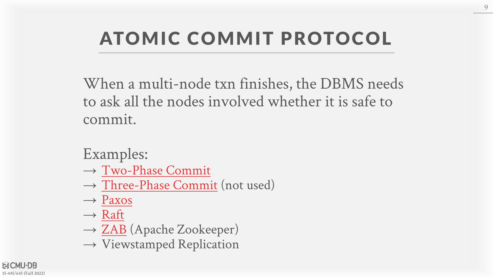

# 22 - Distributed Transactional Database Systems

## 22 - Distributed Transactional Database Systems

## OLTP VS. OLAP

### On-line Transaction Processing (OLTP)

• Short lived read/write transactions.

• Small footprint.

• Repetitive operations.

### On-line Analytical Processing (OLAP)

• Long-running, read-only queries.

• Complex joins.

• Exploratory queries.

## Distributed Transactions

A transaction is “distributed” if it accesses data on multiple nodes. Executing these transactions is more challenging than single-node transactions because now when the transaction commits, the DBMS has to make sure that all the nodes agree to commit the transaction. The DBMS ensure that the database provides the same ACID guarantees as a single-node DBMS even in the case of node failures, message delays, or message loss.

One can assume that all nodes in a distributed DBMS are well-behaved and under the same administrative domain. In other words, given that there is not a node failure, a node which is told to commit a transaction will commit the transaction. If the other nodes in a distributed DBMS **cannot be trusted**, then the DBMS needs to use a \*\*[_byzantine fault tolerant_](https://en.wikipedia.org/wiki/Byzantine\_fault)_**​**__**​**protocol_ (e.g., blockchain) for transactions.

## Atomic Commit Protocols

When a multi-node transaction finishes, the DBMS needs to ask all of the nodes involved whether it is safe to commit. Depending on the protocol, a majority of the nodes or all of the nodes may be needed to commit. Examples include:

• [Two-Phase Commit](https://en.wikipedia.org/wiki/Two-phase\_commit\_protocol) (Common)

• [Three-Phase Commit](https://en.wikipedia.org/wiki/Three-phase\_commit\_protocol) (Uncommon)

• [Paxos](https://en.wikipedia.org/wiki/Paxos\_\(computer\_science\)) (Common)

• [Raft](https://en.wikipedia.org/wiki/Raft\_\(algorithm\)) (Common)

• [ZAB ](https://en.wikipedia.org/wiki/Apache\_ZooKeeper)(Zookeeper Atomic Broadcast protocol, **Apache Zookeeper**)

• Viewstamped Replication (first provably correct protocol)

If the coordinator fails after the prepare message is sent, Two-Phase Commit (2PC) blocks until the coordinator recovers. On the other hand, Paxos is non-blocking if a majority of participants are alive, provided that there is a sufficiently long period without further failures. **If the nodes are in the same data center, do not fail often**, and are not malicious, then **2PC is often preferred over Paxos** as 2PC usually results in fewer round trips.

### Two-Phase Commit

The client sends a _Commit Request_ to the coordinator. In the first phase of this protocol, the coordinator sends a _Prepare_ message, essentially asking the participant nodes if the current transaction is allowed to commit. If a given participant verifies that the given transaction is valid, they send an _OK_ to the coordinator. If the coordinator receives an _OK_ from all the participants, the system can now go into the second phase in the protocol. If anyone sends an _Abort_ to the coordinator, the coordinator sends an _Abort_ to the client.

The coordinator sends a _Commit_ to all the participants, telling those nodes to commit the transaction, if all the participants sent an _OK_. Once the participants respond with an _OK_, the coordinator can tell the client that the transaction is committed. If the transaction was aborted in the first phase, the participants receive an _Abort_ from the coordinator, to which they should respond to with an _OK_. Either everyone commits or no one does. The **coordinator can also be a participant** in the system.

Additionally, in the case of a crash, all nodes keep track of a **non-volatile log** of the outcome of each phase. Nodes block until they can figure out the next course of action. If the coordinator crashes, the participants must decide what to do. A safe option is just to abort. Alternatively, the nodes can communicate with each other to see if they can commit without the explicit permission of the coordinator. If a participant crashes, the coordinator assumes that it responded with an abort if it has not sent an acknowledgement yet.

**Optimizations:**

• _Early Prepare Voting_ – If the DBMS sends a query to a remote node that it knows will be the last one executed there, then that node will also return their vote for the prepare phase **with the query result**.

• _Early Acknowledgement after Prepare_ – If all nodes vote to commit a transaction, the coordinator can send the client an acknowledgement that their transaction was successful **before** the commit phase finishes.

## Paxos

Paxos (along with Raft) is more prevalent in modern systems than 2PC. 2PC is a degenerate case of Paxos; Paxos uses $2F + 1$ coordinators and makes progress as long as at least $F + 1$ of them are working properly, 2PC sets $F = 0$.

Paxos is a consensus protocol where a coordinator proposes an outcome (e.g., commit or abort) and then the participants vote on whether that outcome should succeed. This protocol does not block if a majority of participants are available and has provably minimal message delays in the best case. For Paxos, the coordinator is called the **proposer** and participants are called **acceptors**.

The client will send a _Commit Request_ to the proposer. The proposer will send a _Propose_ to the other nodes in the system, or the acceptors. A given acceptor will send an _Agree_ if they have not already sent an _Agree_ on a **higher** logical timestamp. Otherwise, they send a _Reject_.

Once the majority of the acceptors sent an _Agree_, the proposer will send a _Commit_. The proposer must wait to receive an _Accept_ from the majority of acceptors before sending the final message to the client saying that the transaction is committed, unlike 2PC.

Use exponential back off times for trying to propose again after a failed proposal, to avoid dueling proposers.

`propose(n+1)`比`Commit(n)`先到，所以会拒绝通过`commit(n)`。

**Multi-Paxos:** If the system elects a single leader that oversees proposing changes for some period, then it can skip the **propose** phase. The system periodically renews who the leader is using another Paxos round. When there is a failure, the DBMS can fall back to full Paxos.

## Replication

The DBMS can replicate data across redundant nodes to increase availability. In other words, if a node goes down, the data is not lost, and the system is still alive and does not need to be rebooted. One can use Paxos to determine which replica to write data to.

### Number of Primary Nodes

In **Primary-Replica,** all updates go to a designated primary for each object. The primary propagates updates to its replicas without an atomic commit protocol, coordinating all updates that come to it. Read-only transactions may be allowed to access replicas if the most up-to-date information is not needed. If the primary goes down, then an election is held to select a new primary.

In **Multi-Primary**, transactions can update data objects at any replica. Replicas must synchronize with each other using an atomic commit protocol like Paxos or 2PC.

### K-Safety

K-safety is a threshold for determining the fault tolerance of the replicated database. The value $K$ represents the number of replicas per data object that must always be available. If the number of replicas goes below this threshold, then the DBMS halts execution and takes itself offline. A higher value of $K$ reduces the risk of losing data. It is a threshold to determine how available a system can be.

### Propagation Scheme

When a transaction commits on a replicated database, the DBMS decides whether it must wait for that transaction’s changes to propagate to other nodes before it can send the acknowledgement to the application client. There are two propagation levels: **synchronous (strong consistency)** and **asynchronous (eventual** **consistency)** .

In a _synchronous_ scheme, the primary sends updates to replicas and then waits for them to acknowledge that they fully applied (i.e., logged) the changes. Then, the primary can notify the client that the update has succeeded. It ensures that the DBMS will not lose any data due to strong consistency. This is more common in a traditional DBMS.

In an _asynchronous_ scheme, the primary immediately returns the acknowledgement to the client without waiting for replicas to apply the changes. Stale reads can occur in this approach, since updates may not be fully applied to replicas when read is occurring. If some data loss can be tolerated, this option can be a viable optimization. **This is used commonly in NoSQL systems.**

### Propagation Timing

For _continuous_ propagation timing, the DBMS sends log messages immediately as it generates them. Note that commit and abort messages also need to be sent. Most systems use this approach.

For _on commit_ propagation timing, the DBMS only sends the log messages for a transaction to the replicas once the transaction is committed. This does not waste time for sending log records for aborted transactions. It does make the assumption that a transaction’s log records fit entirely in memory.

### Active vs Passive

There are multiple approaches to applying changes to replicas. For _active-active_, a transaction executes at each replica independently. At the end, the DBMS needs to check whether the transaction ends up with the same result at each replica to see if the replicas committed correctly. This is difficult since now the ordering of the transactions must sync between all the nodes, making it less common.

For _active-passive_, each transaction executes at a single location and propagates the overall changes to the replica. The DBMS can either send out the physical bytes that were changed, which is more common, or the logical SQL queries. Most systems are active-passive.

## CAP Theorem

The _CAP Theorem_, proposed by Eric Brewer and later proved in 2002 at MIT, explained that it is impossible for a distributed system to always be _C_onsistent, _A_vailable, and _P_artition Tolerant. Only two of these three properties can be chosen.

_Consistency_ is synonymous with linearizability for operations on all nodes. Once a write completes, all future reads should return the value of that write applied or a later write applied. Additionally, once a read has been returned, future reads should return that value or the value of a later applied write. NoSQL systems compromise this property in favor of the latter two. Other systems will favor this property and one of the latter two.

_Availability_ is the concept that all nodes that are up can satisfy all requests.

_Partition tolerance_ means that the system can still operate correctly despite some message loss between nodes that are trying to reach consensus on values. If consistency and partition tolerance is chosen for a system, updates will not be allowed until a majority of nodes are reconnected, typically done in traditional or NewSQL DBMSs.

There is a modern version that considers consistency vs. latency trade-offs: [_**PACELC Theorem**_](https://en.wikipedia.org/wiki/PACELC\_theorem). In case of network partitioning (P) in a distributed system, one has to choose between availability (A) and consistency (C), else (E), even when the system runs normally without network partitions, one has to choose between latency (L) and consistency (C).

> In [theoretical computer science](https://en.wikipedia.org/wiki/Theoretical\_computer\_science), the **PACELC theorem** is an extension to the [CAP theorem](https://en.wikipedia.org/wiki/CAP\_theorem). It states that in case of network partitioning (P) in a distributed computer system, one has to choose between availability (A) and consistency (C) (as per the CAP theorem), but else (E), even when the system is running normally in the absence of partitions, one has to choose between latency (L) and consistency (C).

[Kyle Kingsbury's Jepsen Project](https://aphyr.com/tags/jepsen)

