# 26 - Live Call-in Q&A Lecture

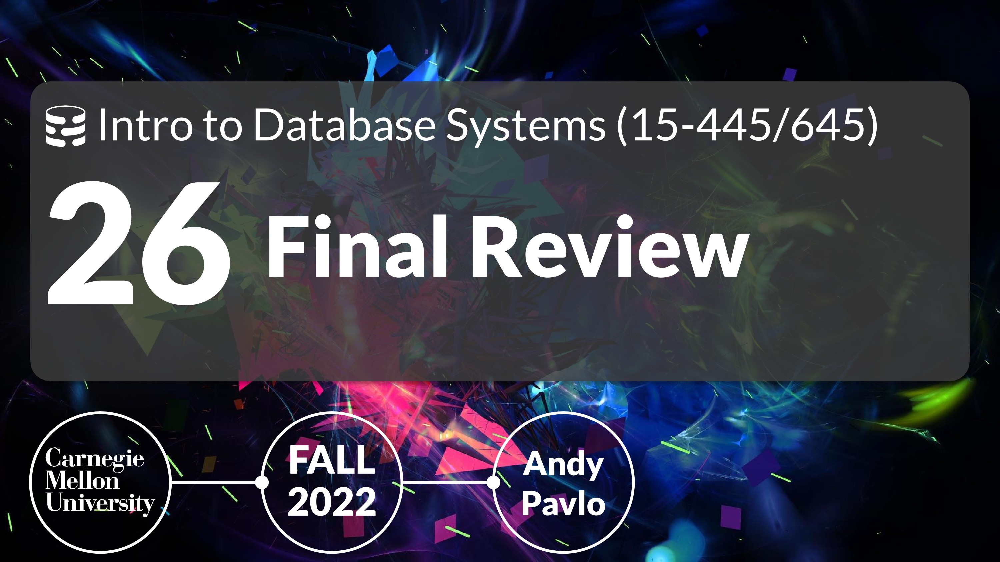

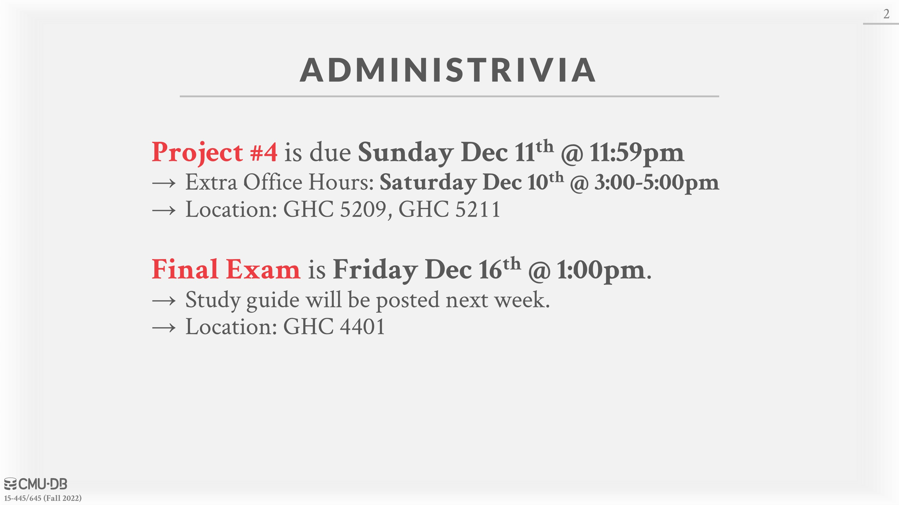

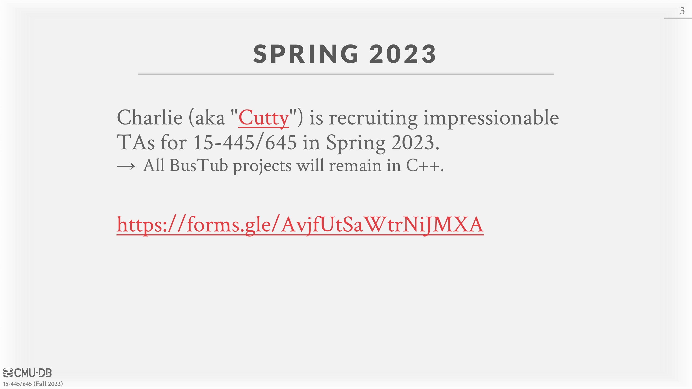

[https://forms.gle/AvjfUtSaWtrNiJMXA](https://forms.gle/AvjfUtSaWtrNiJMXA)

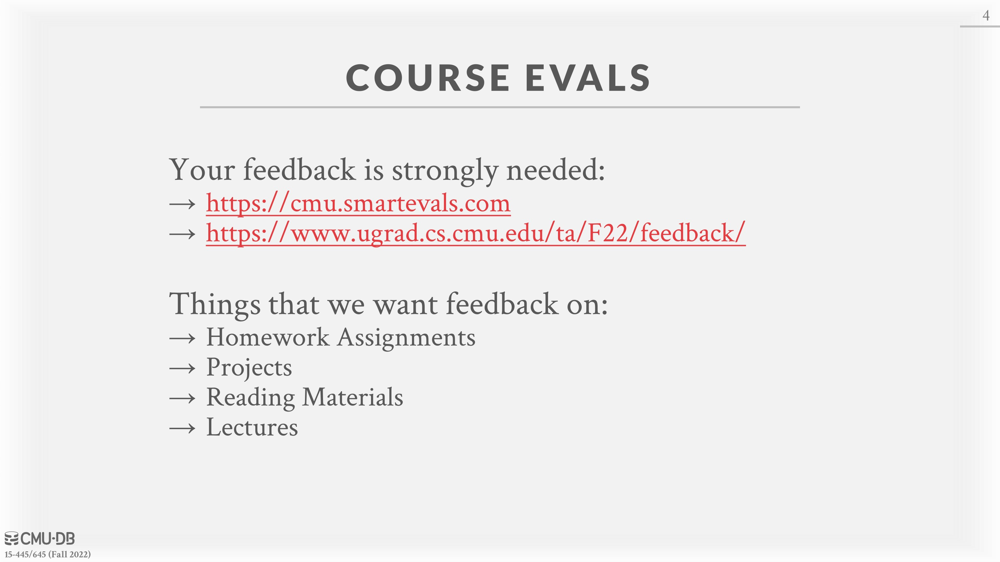

[https://cmu.smartevals.com/](https://cmu.smartevals.com/)

[https://www.ugrad.cs.cmu.edu/ta/F22/feedback/](https://www.ugrad.cs.cmu.edu/ta/F22/feedback/)

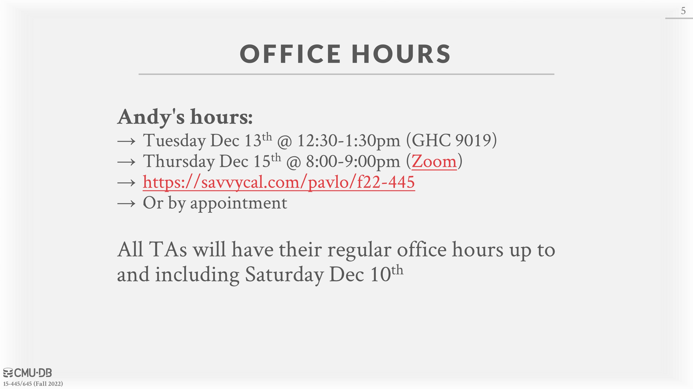

[https://savvycal.com/pavlo/f22-445](https://savvycal.com/pavlo/f22-445)

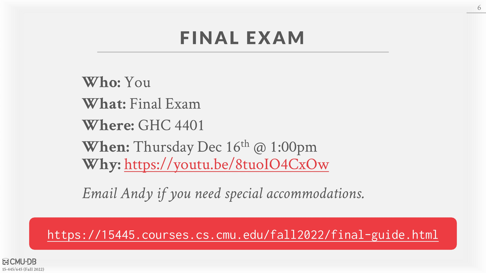

[https://www.youtube.com/watch?v=8tuoIO4CxOw](https://www.youtube.com/watch?v=8tuoIO4CxOw)

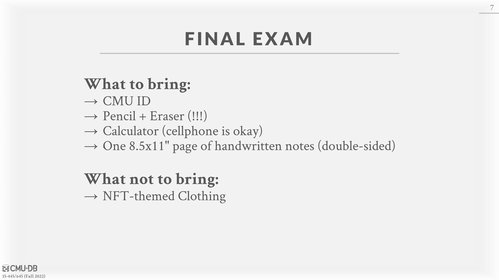

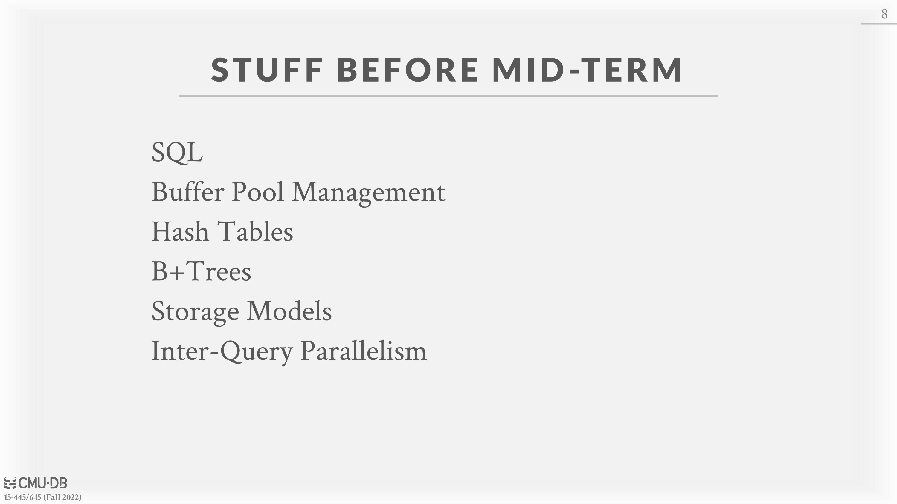

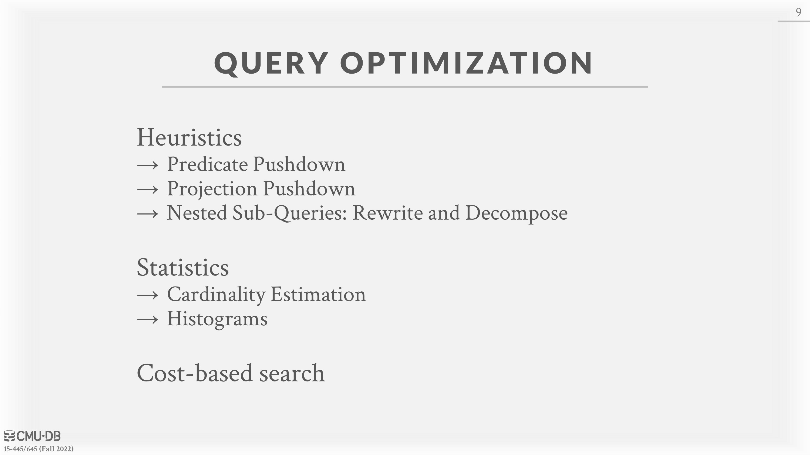

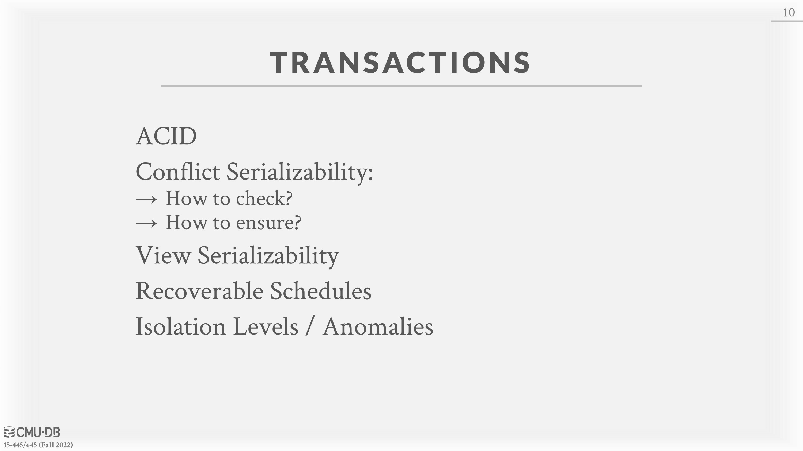

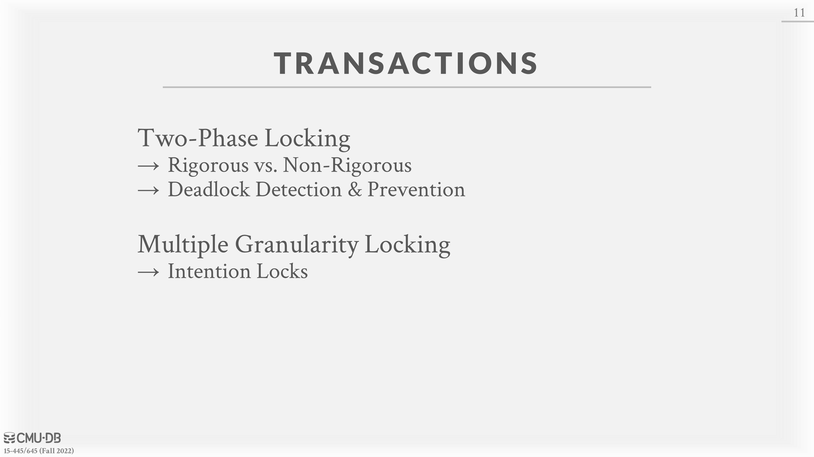

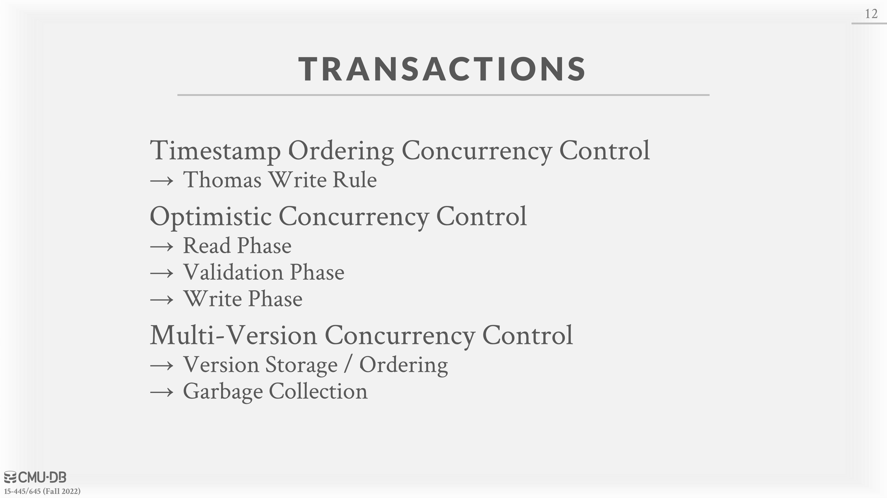

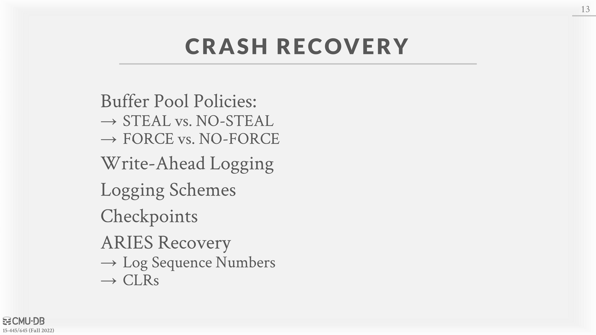

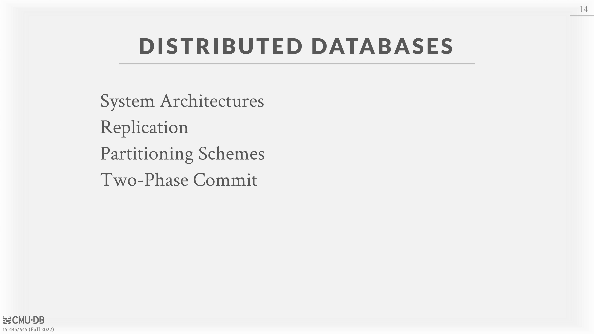

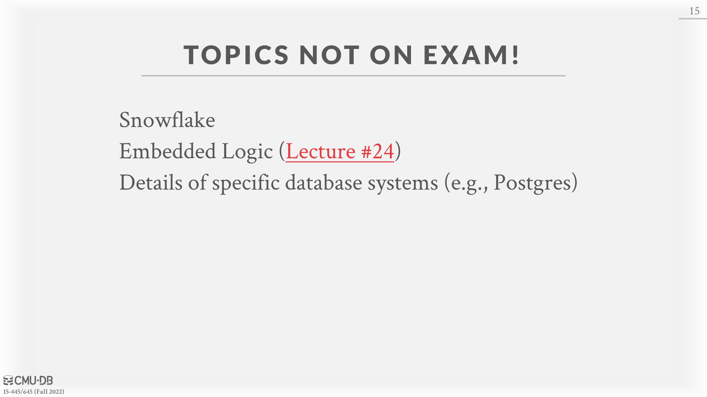

**[Lecture #24: Embedded Database Logic](https://15445.courses.cs.cmu.edu/fall2022/schedule.html#dec-01-2022)**
